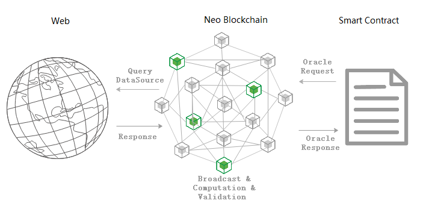

# Oracles

Oracle solutions enable the Blockchain to obtain external data from the outside network. As a gateway for smart contracts to communicate with the outside network, Oracles open a window to the outside world for the blockchain. For data requested outside the Blockchain, Oracles guarantee the truthfulness or reliability of the results through multi-party verification, and store the results in the form of blocks on the chain for the smart contract to get access to this data.

## Neo Oracles

Neo provides a built-in Oracle service with native contracts, which can be invoked by other contracts. In order to get the data outside the blockchain, the contract first needs to construct an Oracle request transaction, and after it is deployed on the chain, the Neo Oracle service can be invoked.

Oracle nodes elected by the committee and other nodes in the network assist in the operation of transactions. When the Oracle transaction is broadcast, each node stores the currently unverified transaction as a known hash in its memory pool and pass it to other nodes. Through this process, the Oracle node of the Oracle transaction uses the URL and filters to complete all included requests. Then, by appending the result to the TransactionAttribute part of the Oracle transaction, these nodes reach a consensus on the response data that returned.

Once enough signatures are collected, the Oracle transaction is regarded as verified and stored in a block by the consensus node, which can be accessed by the contract after the block is on the chain.

Oracle nodes charge a certain amount of transaction fees. You can pay GAS for Oracle transactions on Neo blockchain.



## Oracle requests

| Field            | Bytes     | Description                                                  |
| ---------------- | --------- | ------------------------------------------------------------ |
| Url              | string    | Url of the request                                           |
| Filter           | string    | Filter, used to filter useless data                          |
| CallbackContract | 20 bytes  | Callback the contract                                        |
| CallbackMethod   | string    | The callback method name                                     |
| UserData         | var bytes | Extra data provided by the user                              |
| GasForResponse   | long      | The fee for getting the response, which is set by the contract that calls the Oracle service |

### Url

Oracle service currently supports two URL schemes, `https` and
`neofs`. `https` scheme follows [RFC 2818](https://tools.ietf.org/html/rfc2818)
and [RFC 2616](https://tools.ietf.org/html/rfc2616) standards and allows to
specify resource to request via HTTP GET method. `neofs` scheme is
Neo-specific. Both types of requests are treated equal otherwise.

It is expected that URL requested will provide data in JSON format, for HTTP
requests it means that server must answer with `Content-Type:
application/json` header for request to be successful.

#### NeoFS URLs

NeoFS URLs use the following scheme:

```
neofs://<Container-ID>/<Object-ID/<Command>/<Params>
```

Where `Container-ID` and `Object-ID` are mandatory components, `Command` and
`Params` are optional.

Absent any command oracle subsystem will get an object and return its payload,
example: neofs://C3swfg8MiMJ9bXbeFG6dWJTCoHp9hAEZkHezvbSwK1Cc/3nQH1L8u3eM9jt2mZCs6MyjzdjerdSzBkXCYYj4M4Znk.

Command `range` can be used to get a part of object's payload, it has a
mandatory range parameter specified as `offset|length`, where `offset` is a
number of bytes to skip from the beginning on payload and `length` is a number
of bytes to return to the caller, they're separated by vertical bar. Example
request: neofs://C3swfg8MiMJ9bXbeFG6dWJTCoHp9hAEZkHezvbSwK1Cc/3nQH1L8u3eM9jt2mZCs6MyjzdjerdSzBkXCYYj4M4Znk/range/42|128.

Command `header` can be used to get header of an object, it doesn't have any
parameters. Example: neofs://C3swfg8MiMJ9bXbeFG6dWJTCoHp9hAEZkHezvbSwK1Cc/3nQH1L8u3eM9jt2mZCs6MyjzdjerdSzBkXCYYj4M4Znk/header.

Command `hash` can be used to get SHA256 hash of an object or part of it, it has
an optional range parameter with the same syntax as for `range`
command. Example: Example: neofs://C3swfg8MiMJ9bXbeFG6dWJTCoHp9hAEZkHezvbSwK1Cc/3nQH1L8u3eM9jt2mZCs6MyjzdjerdSzBkXCYYj4M4Znk/hash.

### GasForResponse

The fee for getting the response. `GasForResponse` should not be less than 0.1 GAS, otherwise the Oracle request cannot be initiated.

### Filter

Filters are used to filter out useful information in the results returned from the data source, where the Filter field is a `JSONPath` expression. For more information, click [Here](https://github.com/json-path/JsonPath).

## Oracle response

When constructing the `Response` transaction, the `finish` method of the Oracle contract is called to execute the callback function `CallbackMethod`. The callback function is defined in the request transaction contract. The callback function usually requires the following fields:

| Field    | Bytes     | Description                     |
| -------- | --------- | ------------------------------- |
| Url      | string    | Url of the request              |
| UserData | var bytes | Extra data provided by the user |
| Code     | byte      | Oracle response code            |
| Result   | var bytes | Response result                 |

### Code
The Code field defines the execution result of response transactions. It includes the following five types:

| Value  | Response    | Description                        | Type   |
| ------ | ----------- | ---------------------------------- | ------ |
| `0x00` | `Success`   | Executed successfully.             | `byte` |
| `0x01` | `NotFound`  | The requested message is not found | `byte` |
| `0x12` | `Timeout`   | Execution timeout                  | `byte` |
| `0x14` | `Forbidden` | No execution permission            | `byte` |
| `0xff` | `Error`     | Execution error                    | `byte` |

## An Oracle contract example

```C#
    public class OracleDemo : SmartContract
    {
        public static void DoRequest()
        {
            string url = "http://127.0.0.1:8080/test";
            string filter = "$.value";  // JSONPath, { "value": "hello world" }
            string callback = "callback";
            object userdata = "userdata"; // arbitrary type
            long gasForResponse = 10000000; // minimum fee 

            Oracle.Request(url, filter, callback, userdata, gasForResponse);
        }

        public static void Callback(string url, string userdata, int code, string result)
        {
            object ret = Json.Deserialize(result); // [ "hello world" ]
            object[] arr = (object[])ret;
            string value = (string)arr[0];

            Runtime.Log("userdata: " + userdata);
            Runtime.Log("response value: " + value);
        }
    }
```
