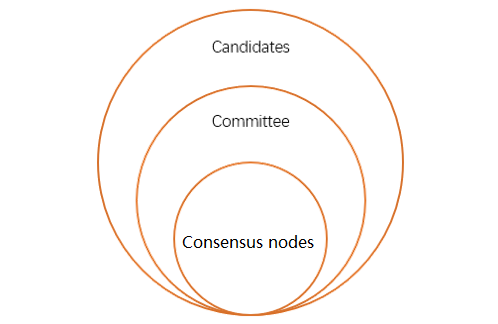

# Governance and Incentives

As a community-driven open platform, Neo N3's on-chain governance model introduces new, essential roles along with an incentive model to ensure that all participants are rewarded accordingly. 

## Governance Strategy

The new governance model consists of candidates, committee members, and consensus nodes. Among them, the committee is responsible for parameter adjustment of the main net and maintenance of the on-chain environment; Consensus nodes are responsible for packaging transactions and generating blocks. Committee members and consensus nodes are elected from certain number of candidates with most votes. Their relationship can be described in the following picture. There is no explicit relationship between committee members and consensus nodes but, as default committee member amount (21) is more than that of consensus nodes (7), generally speaking consensus nodes are a subset of committee members.

### Candidates

Any and all individuals or organizations can register to become a candidate and seek votes from voters to become a committee member. After the registration transaction has been recorded on-chain, NEO holders can vote for the candidates they believe are best equipped to make the right decisions for Neo. The votes received by a candidate is calculated every 21 blocks as the sum of NEO tokens on all wallet addresses that have voted for that candidate over the past epoch. 

To ensure that committee members are truly supported by the community, elections are only effective when more than 20% of NEO tokens are used to vote. Afterwards, a certain number of candidates with most votes automatically become committee members and consensus nodes.

### Committee

The committee members are elected from candidates with the top 21 most votes. The votes received by a candidate is calculated every 21 blocks, so voters can adjust their voting strategies flexibly according to the performance of the committee.

For any proposal to be approved, over 50% of committee members must reach an agreement before signing a transaction to update blockchain params on-chain.  

Moreover, the committee can appoint a number of node roles, including:

- Oracle nodes
- StateRoot consensus nodes
- NeoFS Inner Ring nodes

### Consensus Nodes 

Amongst the 21 committee members, the top voted seven committee members also serve as consensus nodes to promote transaction activity and optimize the Neo blockchain’s security. They have the authority to initiate new block proposals and generate blocks. 

Similar to committee members, consensus nodes are refreshed every 21 blocks.

## Incentives

Inheriting from Neo Legacy, Neo N3 employs the dual-token mechanism, where NEO is used for governance and GAS is used for payment.

### NEO

NEO has a max supply of 100 million tokens and the smallest unit of 1, or in other words, is not divisible. NEO holders are the owners and managers of the Neo network. By constructing voting transactions on the Neo network, they can exercise management power, such as electing consensus nodes, adjusting consensus strategy, adjusting pricing model, etc., and can also claim the corresponding GAS based on the amount of NEO they hold.

### GAS

GAS is the fuel token for the realization of Neo network resource control, with a smallest unit of 0.00000001. Users can obtain GAS either through a claim or purchase. When using the Neo network, they need to pay a certain amount of GAS as network fees, such as transfer, registering assets, publishing assets, running DApps, etc.

### GAS Distribution Rule  

In the initial configuration, 5 GAS tokens will be generated per block—this in turn will be distributed to the Neo Committee (consisting of consensus nodes and candidate nodes), NEO voters, and all NEO holders. The generated GAS will be distributed according to certain rules shown as down below:

**NEO holders – 10%**

As with Neo Legacy, this portion of GAS is not distributed voluntarily to NEO holders. It is calculated and distributed to NEO holder’s wallet according to the NEO holding period only after NEO holder has completed a transfer or voting of NEO. 

**committee & consensus nodes – 10%** 

The remaining 10% is used to reward 21 committee members for their contributions towards managing and governing the Neo blockchain. Every 21 blocks (known as an Epoch) votes for committee members are recalculated and the incentive shares are redistributed in turn to new members. In addition, the speaker receives network fees for the transactions contained in the current block.

**Voters – 80%**

The vast majority of GAS generated will be used to incentivize NEO holders to vote for committee members. Only those who successfully votes for the elected committee members can receive this part of reward, which is calculated and distributed during each epoch (21 blocks). In other words, this portion is divided by 28 (21 for committee members, and 7 for consensus nodes). NEO holders who vote for any elected consensus nodes is rewarded with 2/28 of this portion; NEO holders who voted for any elected committee member which is not a consensus node receive 1/28 of this portion.

## See Also

[Governance API](../reference/governance_api.md)

[Neo Governance Page](https://neo.org/gov)

