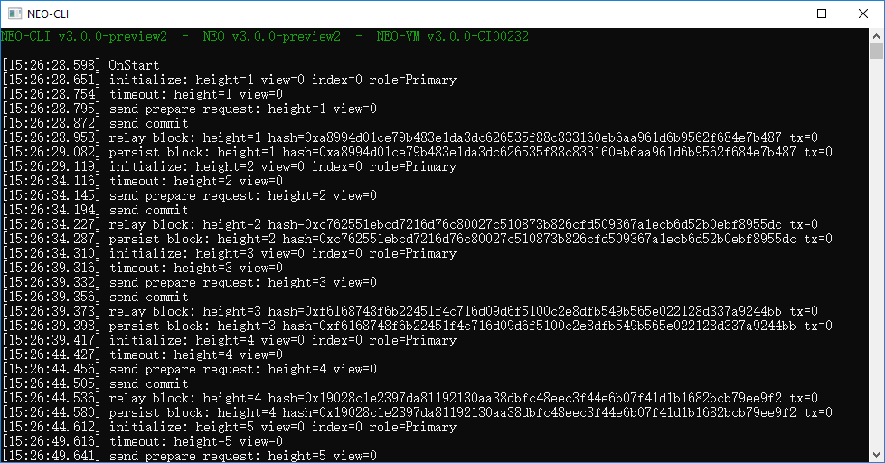

# Build a private chain with one node

Neo-CLI supports generating blocks without consensus nodes, which means you can set up a private chain with one node. To simplify the process, you can directly down the project [Neo-Private-Net](https://github.com/chenzhitong/NEO-Private-Net) to run the private chain quickly.  

Alternatively, you can build a private chain with one node from scratch, which will be elaborated in the following sections.

## Prerequisites

1. Refer to [Installation of NEO-CLI](../../../node/cli/setup.md) to install Neo-CLI.

2. Run Neo-CLI and enter the command `create wallet <path>` to create a wallet, e.g. `create wallet consensus.json`:

   

3. Record the wallet pubkey that appears. This will be used in later steps.

## Modifying the node configuration files

### Modifying config.json

In config.json under the Neo-cli directory, make the following configurations:

- In `UnlockWallet` specify the wallet path and wallet password.
- Set  `StartConsensus` and `IsActive` as true.
- Set  `ConsoleOutput` and `Active` as true.

Here is an example：

```json
{
  "ApplicationConfiguration": {
    "Logger": {
      "Path": "Logs_{0}",
      "ConsoleOutput": true,
      "Active": true
    },
    "Storage": {
      "Engine": "LevelDBStore"
    },
    "P2P": {
      "Port": 10003,
      "WsPort": 10004
    },
    "UnlockWallet": {
      "Path": "consensus.json",
      "Password": "1",
      "StartConsensus": true,
      "IsActive": true
    },
    "PluginURL": "https://github.com/neo-project/neo-modules/releases/download/v{1}/{0}.zip"
  }
}
```

### Modifying protocol.json

1. Open protocol.json under the Neo-cli directory
2. Set `ValidatorsCount` to 1
3. In StandbyCommittee enter the public key of the wallet consensus.json created before (It is single node mode when there is only one public key included in StandbyCommittee).

Here is an example：

```json
{
  "ProtocolConfiguration": {
    "Magic": 213123,
    "MillisecondsPerBlock": 5000,
    "ValidatorsCount": 1,
    "StandbyCommittee": [
      "02ab72b02e1c58b1999a31d88863548afbdd72e8ae48769e6bf07f0a8dc2621722"
    ],
    "SeedList": [
    ]
  }
}
```

## Starting the private chain

Run the command line and enter the Neo-CLI directory. Then enter  `neo-cli.exe` to start the private chain. The private chain is set up successfully when it goes as shown below:



The private chain is terminated if you close the window.

## Withdrawing NEO and GAS

### Using Neo-CLI to withdraw

In the genesis block of the Neo network, 100 million NEO and 30 million GAS are generated. When the private chain is set up, you can withdraw those NEO and GAS from a multi-party address with Neo-CLI, to facilitate your blockchain development and testing.

1. Copy another Neo-CLI directory as an external node.

2. In the node `protocol.json` file, add the consensus node tcp address (localhost:10003) into the `seedlist` field, as shown below:

   ```
   {
     "ProtocolConfiguration": {
       "Magic": 213123,
       "MillisecondsPerBlock": 5000,
       "ValidatorsCount": 1,
       "StandbyCommittee": [
         "02ab72b02e1c58b1999a31d88863548afbdd72e8ae48769e6bf07f0a8dc2621722"
       ],
       "SeedList": [
       "localhost:10003"
       ]
     }
   }
   ```

3. Modify the node config.json:

   ```
   {
     "ApplicationConfiguration": {
       "Logger": {
         "Path": "Logs_{0}",
         "ConsoleOutput": true,
         "Active": true
       },
       "Storage": {
         "Engine": "LevelDBStore"
       },
       "P2P": {
         "Port": 20003,
         "WsPort": 20004
       },
       "UnlockWallet": {
         "Path": "",
         "Password": "",
         "StartConsensus": false,
         "IsActive": false
       },
       "PluginURL": "https://github.com/neo-project/neo-modules/releases/download/v{1}/{0}.zip"
     }
   }
   ```
   
4. Start the private chain and the external node

5. From the external node command line, enter `import multisigaddress m pubkeys` to create a multi-part signed address, where:

   `m` is 1 as the minimal signature number and `pubkeys` is the public key of `consensus.json`
   

   ```
   import multisigaddress 1 02ab72b02e1c58b1999a31d88863548afbdd72e8ae48769e6bf07f0a8dc2621722
   ```
   
6. Enter `list asset`，then you should see 100 million NEO and 30 million GAS displayed.

### Using Neo-GUI to withdraw

1. Refer to [Installing Neo-GUI](../../../node/gui/install.md) to download and install Neo-GUI, and then connect it to our private chain.
2. Configure the file config.private.json to make sure the Neo-GUI port is not conflict with the one of Neo-CLI; otherwise, Neo-GUI cannot work as Neo-CLI is running.
3. Start Neo-GUI and open the wallet consensus.json.
4. Click  `+`  besides `Accounts`  and select `Create Multi-signature address`.
5. Fill in the public key of consensus.json and set the minimal signature number to `1`. Click  `OK`.

Now you should see 100 million NEO and 30 million GAS displayed. Since this multi-signature address only requires one signature, operations for transferring assets from a contract address are as same as the normal address.