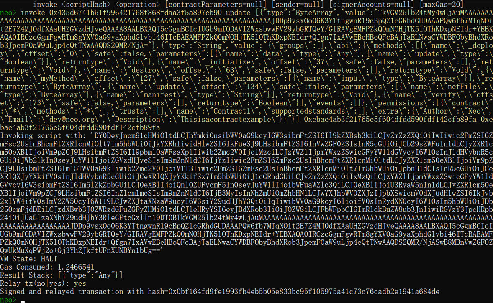

# Contract Update and Destroy

Smart contracts support to be updated or destroyed after release. Before you can do that you need to reserve the specific interfaces in the old contracts.

## Contract Update

In some cases you want to upgrade the smart contracts deployed on the blockchain or migrate the storage of a contract into another new contract, you need to update smart contracts. Neither the contract hash nor the storage area will change when the contract is upgraded.

### Implementing the Update interface
To enable Update function, you need to implement the update method in the contract, the `update` method has been implemented in the contract template by default, as follows:

```c#
public static bool Verify() => IsOwner();

public static void Update(ByteString nefFile, string manifest)
{
    if (!IsOwner()) throw new Exception("No authorization.");
    ContractManagement.Update(nefFile, manifest, null);
}
```

If you want to update the contract later, you must implement the `update` method in the contract prior to deployment. For more information, refer to [Deploying and Invoking Smart Contracts](../deploy/deploy.md).

### Migrating the contract
- Prepare the compiled NEF file and Manifest file for the new contract

- Get the NEF in Base64 format, [File to Base64 online](https://www.hitoy.org/tool/file_base64.php)

- Get the compressed and escaped Manifest, [JSON compressed and escaped online](http://www.bejson.com/zhuanyi/)

- Constructs the parameters of the invoke command

- Call the update method of the contract

For information about invoking the contract, refer to [Invoking contracts](../deploy/invoke.md).



After the `update` method is executed, the contract is upgraded and neither the contract hash nor the storage area is changed.

## Contract Destroy

To destroy a contract, you need to reserve the destruction method in the contract.

To use the contract destroy feature, you need to implement the destroy method in the original contract. method, the `destroy` method has been implemented by default in the contract template as follows.

```c#
public static bool Verify() => IsOwner();

public static void Destroy()
{
    if (!IsOwner()) throw new Exception("No authorization.");
    ContractManagement.Destroy();
}
```

The Destroy method takes no arguments and when it is called, the contract will be deleted, and if the contract has a storage area, the storage area will be deleted as well. After that the contract will not be available.


