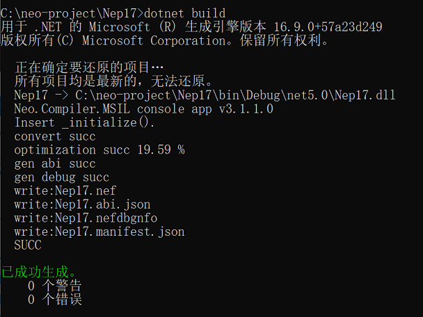

# Developing a contract

We have completed setting up the private chain and configuring the node. In this section we will walk you through configuring the environment, writing, and compiling an NEP17 contract using C#.

The following steps are applicable to multiple system platforms, such as Windows, macOS, and Ubuntu.

## Installing tools

1. Download and install [Visual Studio Code](https://code.visualstudio.com/Download)

2. Download and install [.NET 5.0 SDK](https://dotnet.microsoft.com/download)

3. Run the command line and enter the following command to check if you have installed SDK successfully. 

   ```powershell
   dotnet --list-sdks
   ```

   If there is no issue the SDK version number is displayed.

## Installing contract template

[Neo3.SmartContract.Templates](https://www.nuget.org/packages/Neo3.SmartContract.Templates/) contains the latest contract compiler and a hello contract template. The latest version is recommended：

```powershell
dotnet new -i Neo3.SmartContract.Templates
```

If you want to develop the contracts of **NEO N3 RC1** version, you need to add reference to its compatible version **1.0.2**：

```powershell
dotnet new -i Neo3.SmartContract.Templates::1.0.2
```

## Creating a contract project

1. Create a folder named `Nep17` as the contract project。

2. In the command line go to the `Nep17` path and then enter the command to generate code files based on the template.

   ```powershell
    dotnet new neo3-contract
   ```
   
   You can find the files named by the folder name under `Nep17` directory: Nep17.cs and Nep17.csproj.
   
   If you want to specify the file name, add the option -n, for example, `dotnet new neo3-contract -n tokenA`.

## Editing NEP17 code

1. Download all the .cs files from [NEP17 Template](https://github.com/neo-project/examples/tree/master/csharp/NEP17) and place them under the  `Nep17` directory.

2. Remove the original Nep17.cs generated by the HelloContract template.

3. Run VS Code and install the C# extension as prompted.

   

4. Open the `Nep17` folder to edit the Nep17 template. Refer to [Editing NEP17 Code](#editing-nep17-code).

## Compiling contract file

Run the following command to build your contract：

```powershell
dotnet build
```



Related contract files are outputted under `bin\sc` path in the contract project directory.

## See also

For more information about writing contracts, refer to [Basics](../develop/write/basics.md).

For information about differences between Neo N3 and Neo Legacy contracts, refer to [Differences than Neo Legacy](../develop/write/difference.md)

