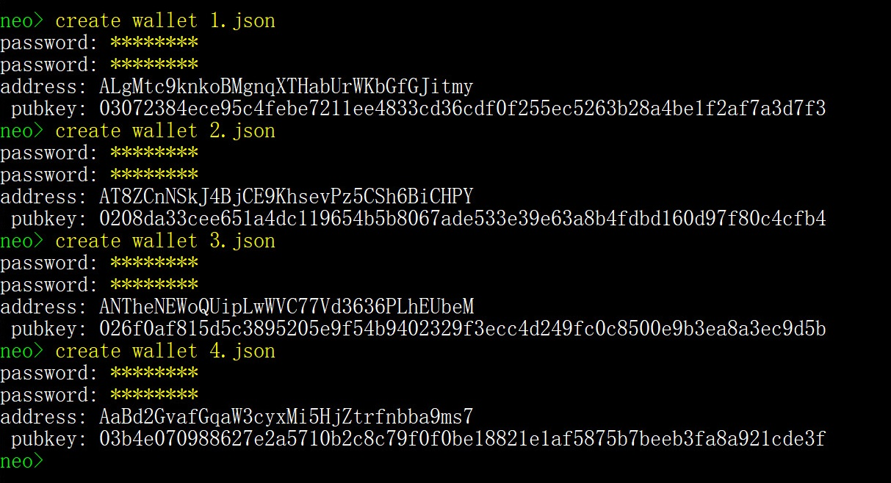

# Build a private chain with virtual machines

This section guides you to build a private chain using four virtual machines and withdraw NEO and GAS from the private chain.

## Configuring the virtual machine

The deployment of an Neo private chain requires at least four servers to reach a consensus, where each server corresponds to a consensus node and a dedicated Neo wallet. Here we created four Windows virtual machines on Azure, the size is Standard DS1 v2 (1 core, 3.5 GB RAM). 


After creating the four virtual machines, open the port 10331-10334 by adding new rules from   `firewall` ->`advanced setting`-> `inbound rules`.

> [!Note]
>
> If you create a virtual machine on a cloud server, you need to log into the administrative backend of the virtual machine and set up a network security group:  `network interface`-> `network security group` ->`inbound security rules`-> `add` ->add the port 10331-10334.

Record the IP addresses after the four virtual machines have been created.

## Installing Neo-CLI

Do the following on four virtual machines:

1. Refer to [Installation of Neo-CLI](../../node/cli/setup.md) and install Neo-CLI.
2. Download [SimplePolicy](https://github.com/neo-project/neo-plugins/releases/). Extract the file and place the Plugins folder under the neo-cli root directory.

## Creating wallet files

1. Create four wallet files, 1.json - 4.json, using Neo-CLI or Neo-GUI. 

   

2. Copy the public keys of four wallets on the screen or use `list key` to view the public keys, and then copy them.

3. Copy the four wallet files into each of the four virtual machines neo-cli folder.

## Modifying configuration files

1. Under each neo-cli directory of the four nodes, open the file `protocol.json` and modify the following:

   - `Magic`: Magic is used to identify the source network of the message, and specifying a different Magic ensures that different network information in the Neo block are not sent to other networks, during transmission. The type of Magic is unit, so note that the value you fill in is in the range [0 - 4294967295].
   - `StandbyValidators`: Enter the four wallet public keys recorded before.
   - `SeedList`: Enter the four virtual machines IP addresses recorded before. Leave the port number as it is. 

   ```json
   {
     "ProtocolConfiguration": {
       "Magic": 1704630,
       "AddressVersion": 23,
       "StandbyValidators": [
   "02f27545181beb8f528d13bbb66d279db996ecb56ed9a324496d114acb48aa7a32",
         "02daa386d979ae6643869a365294055546023acb332ee1a74a5ae5d54774a97bac",
         "0306f12f7217569cdbe9dde9ff702d0040e0a4570873eee63291adaa658128e55c",
         "035781b4d55dc58187f61b5d9277afbaae425deacc5df57f9891f3a5c73ecb24df"
      ],
       "SeedList": [
         "13.75.112.62:10333",
         "137.116.173.200:10333",
         "168.63.206.73:10333",
         "137.116.171.134:10333"
      ],
       "SystemFee": {
         "EnrollmentTransaction": 0,
         "IssueTransaction": 0,
         "PublishTransaction": 0,
         "RegisterTransaction": 0
       }
     }
   }
   ```

2. Modify the config.json file of each node to make the node open the wallet and start consensus automatically once the node is started:

   - `Path`：Enter the corresponding wallet file name.
   - `Password`：Enter the wallet password.
   - `StartConsensus`：Set to `true` to enable consensus.

   ```json
   "UnlockWallet": {
     "Path": "1.json",
     "Password": "11111111",
     "StartConsensus": true,
     "IsActive": true
   }
   ```

## Starting the private chain

In the four virtual machines run the command line and enter the neo-cli directory. Run the command to start the node:`Dotnet neo-cli.dll /rpc`. The wallet is opened automatically and the consensus process is started. If everything goes all right the four nodes will begin a consensus process as shown below:


Four nodes can still achieve consensus, even if one machine is turned off, as shown:


## Withdrawing NEO and GAS

In the genesis block of the Neo network, 100 million NEO and 30 million GAS are generated. When the private chain is set up, you can withdraw those NEO and GAS from a multi-party address with Neo-CLI, to facilitate your blockchain development and testing.

For more information, refer to [Withdrawing NEO and GAS](private-chain2.md#withdrawing-neo-and-gas).
