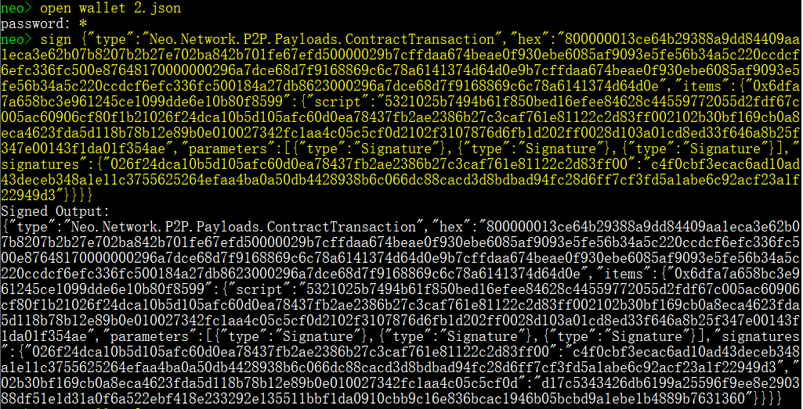
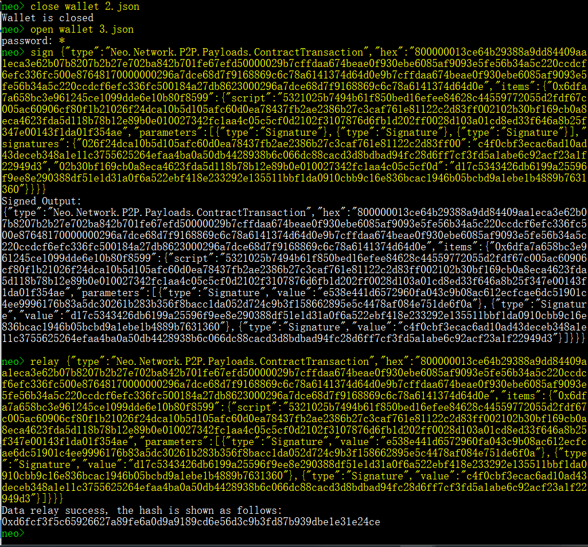

# Build a private chain on local host

In this document we will introduce a simple way to build a private chain on a windows system computer.

## Installing Neo node

Install Neo-CLI and make four copies of the node folder with the name of node1, node2, node3, and node4, successively.

For more information refer to [Installation of Neo-CLI](../../node/cli/setup.md). 

## Creating wallet files

From Neo-CLI or Neo-GUI create four wallets, 1.json, 2.json, 3.json, and 4.json, and place each in the folder of four nodes. 

## Modifying config.json

Make the following configurations in config.json of each node:

- Specify the ports so that each port is not duplicated and is not occupied by other applications.
- In "UnlockWallet" specify the wallet path and wallet password.
- Set `StartConsensus` and `IsActive` as `true`.


You can refer to the following example：

**node1/config.json**

```json
{
  "ApplicationConfiguration": {
    "Logger": {
      "Path": "Logs_{0}",
      "ConsoleOutput": true,
      "Active": true
    },
    "Storage": {
      "Engine": "LevelDBStore"
    },
    "P2P": {
      "Port": 10003,
      "WsPort": 10004
    },
    "UnlockWallet": {
      "Path": "1.json",
      "Password": "1",
      "StartConsensus": true,
      "IsActive": true
    },
    "PluginURL": "https://github.com/neo-project/neo-modules/releases/download/v{1}/{0}.zip"
  }
}
```

**node2/config.json**

```json
{
  "ApplicationConfiguration": {
    "Logger": {
      "Path": "Logs_{0}",
      "ConsoleOutput": true,
      "Active": true
    },
    "Storage": {
      "Engine": "LevelDBStore"
    },
    "P2P": {
      "Port": 20003,
      "WsPort": 20004
    },
    "UnlockWallet": {
      "Path": "2.json",
      "Password": "1",
      "StartConsensus": true,
      "IsActive": true
    },
    "PluginURL": "https://github.com/neo-project/neo-modules/releases/download/v{1}/{0}.zip"
  }
}
```

**node3/config.json**

```json
{
  "ApplicationConfiguration": {
    "Logger": {
      "Path": "Logs_{0}",
      "ConsoleOutput": true,
      "Active": true
    },
    "Storage": {
      "Engine": "LevelDBStore"
    },
    "P2P": {
      "Port": 30003,
      "WsPort": 30004
    },
    "UnlockWallet": {
      "Path": "3.json",
      "Password": "1",
      "StartConsensus": true,
      "IsActive": true
    },
    "PluginURL": "https://github.com/neo-project/neo-modules/releases/download/v{1}/{0}.zip"
  }
}
```

**node4/config.json**

```json
{
  "ApplicationConfiguration": {
    "Logger": {
      "Path": "Logs_{0}",
      "ConsoleOutput": true,
      "Active": true
    },
    "Storage": {
      "Engine": "LevelDBStore"
    },
    "P2P": {
      "Port": 40003,
      "WsPort": 40004
    },
    "UnlockWallet": {
      "Path": "4.json",
      "Password": "1",
      "StartConsensus": true,
      "IsActive": true
    },
    "PluginURL": "https://github.com/neo-project/neo-modules/releases/download/v{1}/{0}.zip"
  }
}
```

> [!Note]
>
> If the plugin RpcServer is installed, you also need to modify the port numbers in the plugin config.json file to make them different from each other and from the ports in config.json of the node.

## Modifying protocol.json

Configure the following parameters in each node protocol.json. Ensure the configuration in each file is consistent.

- Magic: The private chain ID, which can be any integer in the range of [0 - 4294967295].
- StandbyCommittee: The public keys of committee members. The top 4 nodes with the most votes will become consensus nodes. Here enter the public keys of four wallets.
- SeedList: The IP address and port number of the seed node. Specify the IP address as `localhost` and the ports as four P2P ports configured before in config.json.


You can refer to the following example：

```json
{
  "ProtocolConfiguration": {
    "Magic": 213123,
    "MillisecondsPerBlock": 5000,
    "ValidatorsCount": 4,
    "StandbyCommittee": [
      "0243b36969c5e619663fa754f055d9776db71aa61ddc28fdeeb238bff71ed128ca",
      "0284302db73a1926bc9e74ada9b6d51ef16734566f2b043d35bc02b82dff41ac21",
      "02ae647ea6d6c905874cc94b974829472d8c14cc403856031c0cc4b8d94f6fcdd3",
      "02fb99531c3c45771de5f03d928b339ea07ac40aaf2f8b860db197c60f0d00862a"
    ],
    "SeedList": [
    "localhost:10003",
    "localhost:20003",
    "localhost:30003",
    "localhost:40003",
    "localhost:12333"
    ]
  }
}
```

## Creating a shortcut to start

Create a notepad file for ease of starting the private chain. In the file, enter the following:

```
start cmd /k "cd node1 &&ping localhost -n 3 > nul&& dotnet neo-cli.dll"
start cmd /k "cd node2 &&ping localhost -n 3 > nul&& dotnet neo-cli.dll"
start cmd /k "cd node3 &&ping localhost -n 3 > nul&& dotnet neo-cli.dll"
start cmd /k "cd node4 &&ping localhost -n 3 > nul&& dotnet neo-cli.dll"
```

Rename it as Run.cmd, and then place four copies under the same level directories outside each node directory.

At this point the private chain has been set up. All the files  we modified are as follows:

```
├─Run.cmd
|
├─node1
│      1.json
│      config.json
│      protocol.json
│
├─node2
│      2.json
│      config.json
│      protocol.json
│
├─node3
│      3.json
│      config.json
│      protocol.json
│
└─node4
|      4.json
|      config.json
|      protocol.json
```

## Starting the private chain

Enter each node directory and double-click `Run.cmd`. When the screen shows consensus information and block height is increasing as shown below, the private chain is set up successfully.


The private chain is terminated if you close all the windows. 

## Withdrawing NEO and GAS

In the genesis block of the NEO network, 100 million NEO and 30 million GAS are generated. When the private chain is set up, you can withdraw those NEO and GAS from a multi-party address with Neo-CLI for internal development and testing.

### Creating multi-party signature addresses

1. Start your private chain.

2. For ease of operation, copy one of consensus nodes directory as an extra node

3. Open one wallet and create a multi-signature address using the command `import multisigaddress m pubkeys`:

   - `m`: the minimal number of signatures needed to complete the transaction. 
   - `pubkeys`: the public keys in StandbyCommittee in all consensus node wallets.

   For example:

   ```
   import multisigaddress 3    0243b36969c5e619663fa754f055d9776db71aa61ddc28fdeeb238bff71ed128ca 0284302db73a1926bc9e74ada9b6d51ef16734566f2b043d35bc02b82dff41ac21 02ae647ea6d6c905874cc94b974829472d8c14cc403856031c0cc4b8d94f6fcdd3 02fb99531c3c45771de5f03d928b339ea07ac40aaf2f8b860db197c60f0d00862a
   ```

4. Repeat the last step to create multi-signature addresses in other 3 wallets.

5. Enter the command `list asset` and you can see 100 million NEO and 30 million GAS displayed.

   

> [!Note]
>
> You must create the multi-party signature address in each wallet so that the transfer transaction can be signed successfully.

### Transferring NEO to a normal address

Here we want to send NEO from the contract address to the normal address.

1. Open the wallet 1.json and input the command `send <id|alias> <address> <value>` with the normal address of the wallet desired

2. Copy the SignatureContext and close the wallet.

   

3. Open another wallet (2.json) listed on the multi-signature

4. Use the command `sign <jsonObjectToSign>` with the object copied in step 2

5. Copy the object in Signed Output and close the wallet.

   

6. Repeat the previous steps in the third wallet 3.json. Then you can use `relay <jsonObjectToSign>` and your wallet is ready.

   

7. Use `list asset` to check the wallet balance:

   

Similarly, you can refer to the preceding steps to withdraw GAS from the multi-party signature address.
