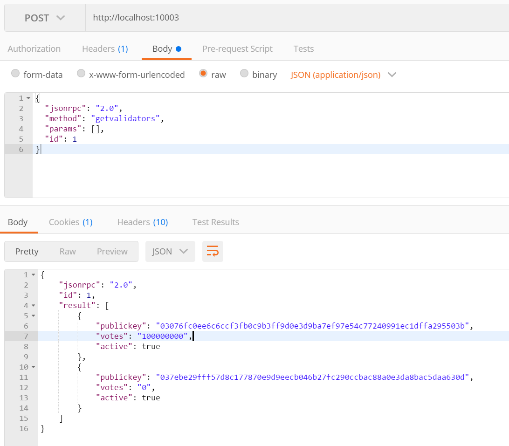

# Election and Voting

Using NEO-GUI you can elect candidates and vote for NEO consensus nodes. After all the NEO consensus nodes reach a consensus through the DBFT algorithm, new blocks are generated. Voting for consensus nodes is conducted constantly in real time in the NEO blockchain. The main process is:

1. NEO nodes register as candidates
2. NEO token holders vote for candidates
3. NEO blockchain determines the consensus nodes based on the number of candidates and their votes cast.

## Election

After the candidates are registered, the NEO token holders can vote for consensus nodes. It costs certain amount of GAS for candidate registration.

To register as a candidate:

1. In NEO-GUI home page click `Advanced` -> `Election`
2. Select the public key of the account in the list and click `OK`. 

You can check if the candidate has been successfully registered using the API [getvalidators](../../reference/rpc/latest-version/api/getvalidators.html).  As shown in the figure below, the candidates' public keys are displayed in the returned json response text.

You can also check the current consensus nodes and candidates in the Neo official website [Consensus Nodes](https://neo.org/consensus).

## Voting

Each NEO node can vote for the candidates. The number of NEO in the current voting account will be automatically calculated as the number of the candidate's votes. For example, if you vote for a candidate from an account that has 100 NEO, the candidate receives 100 votes. If NEO in the account is spent after the vote, the candidate' votes will simultaneously be decreased to the current NEO balance.

To vote:  

1. In NEO-GUI home page click `Advanced` -> `Vote`
2. Choose the account to vote
3. In the Candidates field, enter the public key of the candidate to vote. 
4. Click `OK`. 

You can use the API [getvalidators](../../reference/rpc/latest-version/api/getvalidators.html) to check the candidate votes. As shown in the figure below, the account with the balance of 100000000 voted for the candidate with the public key 03076fc0ee6c6ccf3fb0c9b3ff9d0e3d9ba7ef97e54c77240991ec1dffa295503b. Using the API [getvalidators](../../reference/rpc/latest-version/api/getvalidators.html) you can see the public key and the corresponding votes are displayed in the returned response text.

You can also check the current consensus nodes and candidates in the Neo official website [Consensus Nodes](https://neo.org/consensus).

