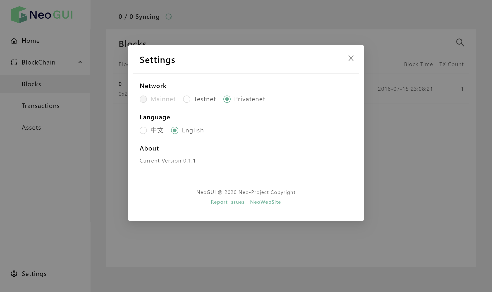

# Installing Neo-GUI

Neo-GUI is a full-node application on the Neo blockchain. It uses Electron cross-platform technology and can run on Windows 10, macOS, and Linux systems.

It has these main functions:

- Viewing and searching blockchain information
- Basic wallet operations, including creating wallets, importing wallets, transferring transactions, etc.
- Deploying and invoking smart contracts
- Election and voting consensus nodes

## Downloading the client

Neo-GUI is an open source project, thus you can download the installation package of the corresponding system version on [GitHub](https://github.com/neo-ngd/Neo3-GUI/releases) , and complete the installation according to the prompts.

> [!Note]
>
> Make sure your Windows system has [.NET Core 3.1](https://dotnet.microsoft.com/download/dotnet-core/current/runtime) installed.

## Connecting to the network

After installation, you need to connect Neo-GUI to the Neo test net or your private chain.

### Connecting to test net

1. Run Neo-GUI and go to any page.
2. Click `Setting` in the lower left corner.
3. Under **Network** check `Testnet`.

After a while, when you see the block synchronization data displayed at the top of the main page is increasing, that indicates your client has connected to the network successfully. 

### Connecting to private chain

If you have already built a private chain (see [Setting up  private chain](../../network/private-chain/solo.md)) and want to connect Neo-GUI to it, do the following:

1. Find the config.json and protocol.json files of your private chain.

   Make sure that the address port configured in protocal.json SeedList can be accessed from this machine.

2. Go to the path `resources\build-neo-node` under Neo-GUI installation directory and find the two files `config.private.json` and `protocol.private.json` 

3. Replace the content of two files with the content of config.json and protocol.json the private chain files you found in Step 1

4. Run Neo-GUI and go to any page.

5. Click `Setting` in the lower left corner.

6. Under **Network** check `Privatenet`.

   

After a while, when you see the block synchronization data displayed at the top of the main page is increasing, that indicates your client has connected to the network successfully. 