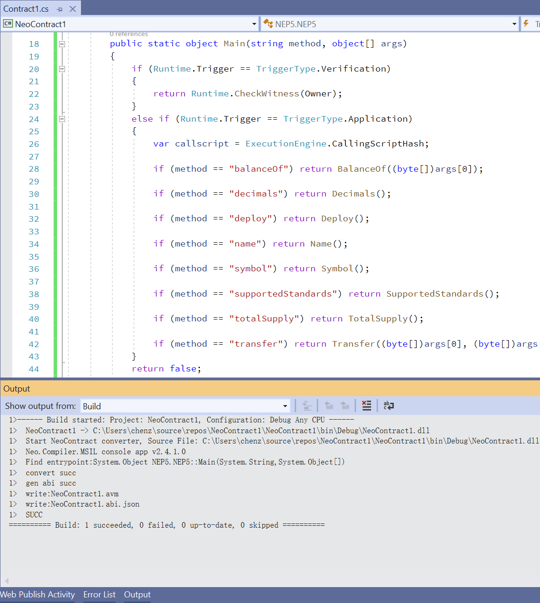

# Compiling a contract sample

So far, we have learned how to build a private chain and connect nodes to the chain. The following part will proceed to environment configuration, Neo smart contract coding and compilation and Neo smart contract deployment and invocation on private chain using C# and Windows 10. 

We will complete the following tasks in this section: 

1. Install contract development environment
2. Create a NEP-5 contract project
3. Compile a contract

## Installing development environment

### Install Visual Studio 2019

Download and install [Visual Studio 2019](https://www.visualstudio.com/products/visual-studio-community-vs) . Select `.NET Core cross-platform development` and `Visual Studio Extension Development` option during installation.

### Install NeoContractPlugin 

Pull project [neo-devpack-dotnet](https://github.com/neo-project/neo-devpack-dotnet) and open it

Compile project `Installer`

Open the just compiled `Neo.SmartContract.Installer.vsix` file in the bin/Debug directory

Install  `Neo.SmartContract.Installer.vsix` Extension

Restart Visual Studio 

### Configure compiler 

Open project [neo-devpack-dotnet](https://github.com/neo-project/neo-devpack-dotnet) 

Publish project `Neo.Compiler.MSIL`，Record the published directory

Open  published directory，such as \bin\Release\netcoreapp3.1\publish，Start PowerShell, enter the command `./neon.exe` to make sure neon starts normally

Add a publishing directory to the environment variable PATH

Start PowerShell anywhere, enter the command `neon.exe` to make sure the environment variable is configured correctly

### Configure Smart Contract Framework

Open project [neo-devpack-dotnet](https://github.com/neo-project/neo-devpack-dotnet)

Compile project `Neo.SmartContract.Framework`

Find the compiled `Neo.SmartContract.Framework.dll` for next use

## Create a Neo contract project

Launch Visual Studio 2019, Create a New NeoContract Project

Right-click on the project to open the `Manage NuGet Package`

Uninstall The NuGet Reference for `Neo.SmartContract.Framework`

Put the previously compiled `Neo.SmartContract.Framework.dll` file into the NeoContract project

Add `Neo.SmartContract.Framework.dll` reference to NeoContract project

At this point, our Neo3 Smart Contract project is created, and then we're writing code.

## Edit NEP-5 Code

After the project was created, we've got a code template for a smart contract.

The sample code is simple, and the function is to deposit a key-value pair of "Hello" to the store.

Many developers are more concerned with publishing their contract assets on the Neo public chain, and now we're implementing them step by step on the private chain.

Here is the [NEP5 example of Neo3](https://github.com/chenzhitong/Neo3-Smart-Contract-Examples/tree/master/NEP5)

Neo3's NEP-5 contract has several changes to Neo2:

1、Add custom attributes above the smart contract class (included in the template)

```c#
[Features(ContractFeatures.HasStorage)]
public class NEP5 : SmartContract
……
```

2、Replace all  `ToBigInteger()` methods to `TryToBigInteger()`

and add an extension to the implementation of the method, [Reference](https://github.com/chenzhitong/Neo3-Smart-Contract-Examples/blob/master/NEP5/Helper.cs)

```c#
public static class Helper
{
    public static BigInteger TryToBigInteger(this byte[] value)
    {
        return value?.ToBigInteger() ?? 0;
    }
}
```

3、Add the Deploy method for first distribution of assets (optional) [Reference](https://github.com/chenzhitong/Neo3-Smart-Contract-Examples/blob/master/NEP5/Contract1.cs)

```c#
public static object Main(string method, object[] args)
{
	……
	if (method == "deploy") return Deploy();
	……
}
```

```c#
[DisplayName("deploy")]
public static bool Deploy()
{
    if (TotalSupply() != 0) return false;
    StorageMap contract = Storage.CurrentContext.CreateMap(nameof(contract));
    contract.Put("totalSupply", TotalSupplyValue);
    StorageMap asset = Storage.CurrentContext.CreateMap(nameof(asset));
    asset.Put(Owner, TotalSupplyValue);
    Transferred(null, Owner, TotalSupplyValue);
    return true;
}
```

## Compiling contract file

Click `BUILD`->`Build Solutions` (hotkeys: Ctrl + Shift + B) in the menu to start compilation.



When the compilation is done, Neo smart contract file named `NeoContract1.avm` is generated in the `bin/Debug` directory of the project.


`NeoContract1.abi.json` is a descriptive file of the smart contract, which contains desciptions of the ScriptHash, entry, parameters and return values of the contract. More information about the smart contract ABI can be found in [NeoContract ABI](https://github.com/neo-project/proposals/blob/master/nep-3.mediawiki).

## What's next?

[Deploying and invoking contract](deploy.md)

