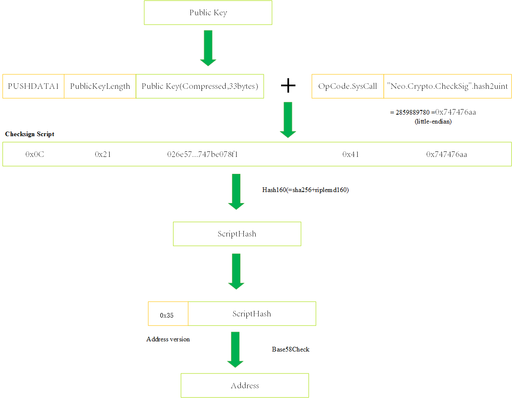
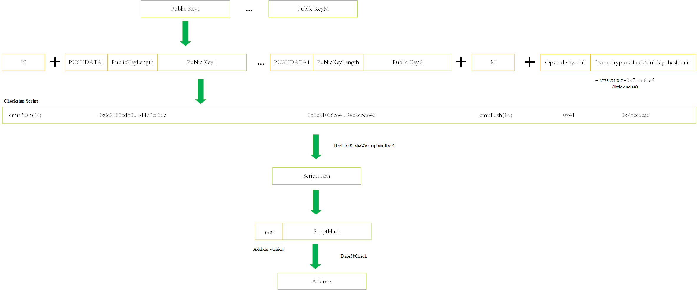

# 钱包

钱包是Neo的基础组件，是用户接入Neo网络的载体，负责完成与之相关一系列的工作和任务。

Neo的钱包可以自行设计和修改，但需要满足一定的规则。

##  账户

Neo 中，账户即合约，地址代表的为一段合约代码，从私钥到公钥，再到地址的流程如下图。


### 私钥

私钥是一个随机生成的位于 1 和 n 之间的任意数字（n 是⼀个常数，略小于 2 的 256次方），一般用一个 256bit (32字节) 数表示。

在 Neo 中私钥主要采用两种编码格式：

- hexstring 格式

   hexstring 格式是将byte[]数据使用16进制字符表示的字符串。

- WIF 格式

   wif 格式是在原有32字节数据前后添加前缀0x80和后缀0x01,并做Base58Check编码的字符串

[](../images/wallets/privateKey-wif.png)

 Example: 

| 格式 | 数值 |
|---|---|
| byte[] | [0xc7,0x13,0x4d,0x6f,0xd8,0xe7,0x3d,0x81,0x9e,0x82,0x75,<br>0x5c,0x64,0xc9,0x37,0x88,0xd8,0xdb,0x09,0x61,0x92,0x9e,<br>0x02,0x5a,0x53,0x36,0x3c,0x4c,0xc0,0x2a,0x69,0x62] |
| hexstring | c7134d6fd8e73d819e82755c64c93788d8db0961929e025a53363c4cc02a6962 |
| WIF | L3tgppXLgdaeqSGSFw1Go3skBiy8vQAM7YMXvTHsKQtE16PBncSU |

### 公钥

公钥是通过ECC算法将私钥运算得到的一个点（X, Y）。该点的X、Y坐标都可以用32字节数据表示。Neo与比特币稍有不同，Neo选取了secp256r1曲线作为其ECC算法的参数。在Neo中公钥有两种编码格式：

- 非压缩型公钥

    0x04 + X坐标（32字节）+ Y坐标（32字节）

- 压缩型公钥

    0x02/0x03+X坐标（32字节）

示例:

| 格式 | 数值 |
|----------|:-------------:|
| 私钥 | c7134d6fd8e73d819e82755c64c93788d8db0961929e025a53363c4cc02a6962|
| 公钥（压缩型） | 035a928f201639204e06b4368b1a93365462a8ebbff0b8818151b74faab3a2b61a |
| 公钥（非压缩型） | 045a928f201639204e06b4368b1a93365462a8ebbff0b8818151b74faab3a2b61a35dfabcb79ac492a2a88588d2f2e73f045cd8af58059282e09d693dc340e113f  |

### 地址

地址是由公钥经过一系列转换得到的一串由数字和字母构成的字符串。本节将介绍Neo中的公钥到地址的转换步骤。

> [!Note]
>
> Neo3中的地址脚本发生了变动，不再使用 Opcode.CheckSig, OpCode.CheckMultiSig 指令， 换成使用互操作服务调用，即`SysCall "Neo.Crypto.CheckSig".hash2uint`, `SysCall "Neo.Crypto.CheckMultisig".hash2unit` 方式。

#### 普通地址

1. 通过公钥，构建一个 CheckSig 地址脚本，脚本格式，如下图

    ```
    0x0C + 0x21 + 公钥(压缩型 33字节) + 0x41 + 0x747476aa
    ```

    

2. 计算地址脚本合约哈希 (20字节，由地址脚本合约先做一次SHA256再做一次RIPEMD160得到)

3. 在地址脚本合约哈希前添加版本号（目前Neo所使用的协议版本是53所以对应字节为`0x35`）

4. 对字节数据做Base58Check编码

示例：

| 格式 | 数值 |
|----------|:-------------:|
| 私钥 | 087780053c374394a48d685aacf021804fa9fab19537d16194ee215e825942a0 |
| 压缩型公钥 | 03cdb067d930fd5adaa6c68545016044aaddec64ba39e548250eaea551172e535c |
| 地址脚本 | 0c2103cdb067d930fd5adaa6c68545016044aaddec64ba39e548250eaea551172e535c41747476aa |
| 地址 | NhZ5eahZAZ6UBsbCLcCQH6qqHdzuxt2HKa |

#### 多方签名地址

1. 通过多个地址，构建一个 N-of-M CheckMultiSig 多方签名的地址脚本，脚本格式如下：

   ```
   emitPush(N) + 0x0C + 0x21 + 公钥1(压缩型 33字节)  + .... + 0x0C + 0x21 + 公钥m(压缩型 33字节)  + emitPush(M) + 0x41 + 7bce6ca5
   ```
   

2. 计算地址脚本合约哈希(20字节，地址脚本合约做一次sha256和riplemd160得到)

3. 在地址脚本合约哈希前添加版本号（ 目前Neo所使用的协议版本是53所以对应字节为`0x35`）

4. 对字节数据做Base58Check编码

示例:

| 名称       | 值                                                           |
| ---------- | ------------------------------------------------------------ |
| 私钥       | 087780053c374394a48d685aacf021804fa9fab19537d16194ee215e825942a0<br>9a973a470b5fd7a2c12753a1ef55db5a8c8dde42421406a28c2a994e1a1dcc8a |
| 压缩性公钥 | 03cdb067d930fd5adaa6c68545016044aaddec64ba39e548250eaea551172e535c<br/>036c8431cc78b33177a60b4bcc02baf60d05fee5038e7339d3a688e394c2cbd843 |
| 地址脚本   | 110c21036c8431cc78b33177a60b4bcc02baf60d05fee5038e7339d3a688e394c2cbd8430c2103cdb067d930fd5adaa6c68545016044aaddec64ba39e548250eaea551172e535c12417bce6ca5 |
| 地址       | NZ3pqnc1hMN8EHW55ZnCnu8B2wooXJHCyr                           |

emitPush(number) 注意其取值范围， number的类型为 BigInteger时，data = number.ToByteArray()：

| Number值         | 放入指令                           | 值               |
| ---------------- | ---------------------------------- | ---------------- |
| -1 <= number <= 16  | OpCode.PUSH0 + (byte)(int)number | 0x10 + number   |
| data.Length == 1  | OpCode.PUSHINT8 + data | 0x00 + data   |
| data.Length == 2  | OpCode.PUSHINT16 + data | 0x01 + data   |
| data.Length <= 4  | OpCode.PUSHINT32 + data | 0x02 + PadRight(data, 4)   |
| data.Length <= 8  | OpCode.PUSHINT64 + data | 0x03 + PadRight(data, 8)   |
| data.Length <= 16  | OpCode.PUSHINT128 + data | 0x04 + PadRight(data, 16) |
| data.Length <= 32  | OpCode.PUSHINT256 + data | 0x05 + PadRight(data, 32) |

## 钱包文件

### db3 钱包文件

db3钱包文件是neo采用sqlite技术存储数据所使用存储文件，文件尾缀名：`.db3`。存储时，分别包含如下四张表：

- 账户表 Account

  | 字段                | 类型          | 是否必填 | 备注       |
  | ------------------- | ------------- | -------- | ---------- |
  | PublicKeyHash       | Binary(20)    | 是       | 主键       |
  | Nep2key | VarChar(58) | 是       | 按照NEP2标准加密的密钥nep2Key |

- 地址表 Address

  | 字段       | 类型       | 是否必填 | 备注 |
  | ---------- | ---------- | -------- | ---- |
  | ScriptHash | Binary(20) | 是       | 主键 |

- 合约表 Contract

  | 字段          | 类型       | 是否必填 | 备注                      |
  | ------------- | ---------- | -------- | ------------------------- |
  | RawData       | VarBinary  | 是       |                           |
  | ScriptHash    | Binary(20) | 是       | 主键，外键，关联Address表 |
  | PublicKeyHash | Binary(20) | 是       | 索引，外键，关联Account表 |

- 属性表 Key

  | 字段  | 类型        | 是否必填 | 备注 |
  | ----- | ----------- | -------- | ---- |
  | Name  | VarChar(20) | 是       | 主键 |
  | Value | VarBinary   | 是       |      |

其中Key-Value表中，主要存储了AES256加密用到的4个属性：

- `PasswordHash`：密码的哈希，由密码做sha256得到

- `IV`：AES的初始向量，随机生成

- `MasterKey`：加密密文，由PasswordHash、 IV对私钥做AES256加密得到

- `Version`：版本

> [!Note]
>
> db3钱包采用对称加密AES相关技术作为钱包的加密和解密方法。db3钱包常用在交易所钱包，方便大量的账户信息存储与检索查询。

### NEP6 钱包文件

目前推荐使用NEP6-JSON钱包，安全性更高，具有跨平台特性。NEP6钱包文件是neo满足NEP6标准的钱包存储数据所使用存储文件，文件尾缀名：`.json`。 json文件格式如下：

```json
{
	"name": null,
	"version": "3.0",
	"scrypt": {
		"n": 16384,
		"r": 8,
		"p": 8
	},
	"accounts": [
		{
			"address": "Nf8iN8CABre87oDaDrHSnMAyVoU9jYa2FR",
			"label": null,
			"isdefault": false,
			"lock": false,
			"key": "6PYM9DxRY8RMhKHp512xExRVLeB9DSkW2cCKCe65oXgL4tD2kaJX2yb9vD",
			"contract": {
				"script": "DCEDYgBftumtbwC64LbngHbZPDVrSMrEuHXNP0tJzPlOdL5BdHR2qg==",
				"parameters": [
					{
						"name": "signature",
						"type": "Signature"
					}
				],
				"deployed": false
			},
			"extra": null
		}
	],
	"extra": null
}
```

> 本例中的密码为 `1`

| 字段                            | 描述                            |
| ------------------------------- | ------------------------------- |
| name                            | 名称                            |
| version                         | 版本，目前为3.0                 |
| scrypt（n/r/p）                 | scrypt算法设置CPU性能的三个参数 |
| accounts                        | 钱包所包含的账户的集合          |
| account.address                 | 账户地址                        |
| account.label                   | 标题，默认为null                |
| account.isDefault               | 是否默认账户                    |
| account.lock                    | 是否打开                        |
| account.key                     | 按照NEP2标准加密的密钥nep2Key   |
| account.contract                | 地址脚本合约的详细内容          |
| account.contract.script         | 地址脚本合约的字节              |
| account.contract.parameters     | 地址脚本合约的参数表            |
| account.contract.parameter.name | 地址脚本合约参数的名称          |
| account.contract.parameter.type | 地址脚本合约参数的类型          |
| account.contract.deployed       | 是否部署                        |
| account.extra                   | 账户其他拓展属性                |
| extra                           | 钱包其他拓展属性                |

NEP6钱包采用了以scrypt为核心算法的相关技术作为钱包私钥的加密和解密方法，即Nep2Key:

#### 加密方法


1. 由公钥计算地址，并获取`SHA256(SHA256(Address))`的前四个字节作为地址哈希

2. 使用Scrypt算法算出一个`derivedkey`，并将其64个字节数据分成2半，作为`derivedhalf1`和`derivedhalf2`。Scrypt所使用参数如下：

	- 明文：输入的密码（UTF-8格式）
	- 盐：地址哈希
	- n：16384
	- r：8
	- p：8
	- length：64

3. 把私钥和derivedhalf1做异或，然后用derivedhalf2对其进行AES256加密得到encryptedkey

4. 按照以下格式拼接数据，并对其进行Base58Check编码得到NEP2Key：

    ```
    0x01 + 0x42 + 0xe0 + addressHash + encryptedKey
    ```

#### 解密方法

1. 对NEP2key进行Base58Check解码

2. 验证解码后数据长度为39，以及前3个字节（data[0-2]是否为0x01、0x42、0xe0）

3. 取data[3-6]作为`addresshash`

4. 把密码、addresshash代入Scrypt算法，指定结果长度为64，求出`derivedkey`

5. 把`derivedkey`前32字节作为`derivedhalf1`，后32字节作为`derivedhalf2`

6. 取data[7-38]作为`encryptedkey`（32字节），并用derivedhalf2作为初始向量对其进行AES256解密

7. 把解密结果与Derivedhalf1做异或处理求得私钥

8. 把该私钥做ECC求出公钥，并生成地址，对该地址做2次Sha256然后取结果的前四字节判断其是否与addresshash相同，相同则是正确的私钥（参考NEP2）

相关详细技术请参照neo文档中的NEP2和NEP6提案。

NEP2提案：<https://github.com/neo-project/proposals/blob/master/nep-2.mediawiki>

NEP6提案：<https://github.com/neo-project/proposals/blob/master/nep-6.mediawiki>

## 签名

在使用钱包对交易进行签名时，Neo采用ECDSA签名方法，ECC曲线为nistP256(或Secp256r1), 摘要算法为SHA256。

C# 示例代码：

```c#
        public static byte[] Sign(byte[] message, byte[] prikey, byte[] pubkey)
        {
            using (var ecdsa = ECDsa.Create(new ECParameters
            {
                Curve = ECCurve.NamedCurves.nistP256,
                D = prikey,
                Q = new ECPoint
                {
                    X = pubkey[..32],
                    Y = pubkey[32..]
                }
            }))
            {
                return ecdsa.SignData(message, HashAlgorithmName.SHA256);
            }
        }
```

示例：

| 格式      | 值                                                           |
| --------- | ------------------------------------------------------------ |
| 原文      | hello world                                                  |
| 私钥      | f72b8fab85fdcc1bdd20b107e5da1ab4713487bc88fc53b5b134f5eddeaa1a19 |
| 公钥      | 031f64da8a38e6c1e5423a72ddd6d4fc4a777abe537e5cb5aa0425685cda8e063b |
| signature | b1855cec16b6ebb372895d44c7be3832b81334394d80bec7c4f00a9c1d9c3237541834638d11ad9c62792ed548c9602c1d8cd0ca92fdd5e68ceea40e7bcfbeb2 |

## 钱包功能

| 功能名称       | 描述                                                     |
| -------------- | -------------------------------------------------------- |
| 导入钱包文件   | 从指定钱包文件导入账户信息                               |
| 导出钱包文件   | 将账户信息导出到指定的钱包文件，如db3文件、NEP6 json文件 |
| 解锁钱包       | 验证用户密码来防止账户信息泄露                           |
| 修改密码       | 修改用户密码                                             |
| 生成私钥       | 推荐使用安全的随机数发生器                               |
| 导入私钥       | 从WIF字符串或者数字证书导入私钥到钱包中                  |
| 导出私钥       | 导出账户的私钥                                           |
| 生成公钥       | 使用ECC算法从私钥得到公钥                                |
| 生成地址       | 从私钥生成地址                                           |
| 导入地址       | 添加新的地址到钱包中                                     |
| 导出地址       | 导出账户地址                                             |
| 导入离线数据包 | 从`chain.acc`文件加载区块数据来减少同步时间              |
| 导出离线数据包 | 导出区块数据到`chain.acc`文件                            |
| 同步区块数据   |                                                          |
| 转账           | 转账资产到其他地址                                       |
| 签名           | 对数据签名，比如交易                                     |
| 提取gas        | 提取通过持有neo新分配的gas                               |
| 获取余额       | 显示该钱包中所有账户的资产余额                           |
| 获取交易       | 显示该钱包中产生的交易历史                               |
| 构造多签合约   | 构造多签合约                                             |
| 扩展           |                                                          |
| 部署智能合约   | 部署智能合约                                             |
| 测试智能合约   | 测试智能合约                                             |

## 钱包软件

### 全节点钱包

全节点钱包包含所有区块数据的备份，保存了所有链上数据，并且参与p2p网络通信，所以占用存储空间较大。

Neo-CLI 和 Neo-GUI 都是全节点钱包，相关信息请参考 [Neo节点](../../node/introduction.md)。

### SPV钱包

SPV (Simplified Payment Verification, 简单支付验证)钱包不同于全节点钱包，它不会存储所有的区块数据，仅存储区块头数据，并使用布隆过滤器和梅克尔树算法。它主要在移动端App或者轻节点中使用，因为它能有效得节省存储空间。

如果要开发SPV钱包，请参考Neo网络协议接口。

使用：

    1. SPV钱包发送一个布隆过滤器到全节点，全节点加载该布隆过滤器。
    
    2. SPV钱包发送布隆过滤器的参数到全节点，全节点加载该布隆过滤器的参数。（可选）
    
    3. SPV钱包从全节点查询交易，全节点在使用布隆过滤器过滤后返回交易数据和构造的梅克尔树路径。
    
    4. SPV钱包使用梅尔克树路径来验证交易数据。
    
    5. SPV钱包发送`clear the bloom filter`指令给全节点，全节点清除该布隆过滤器。

