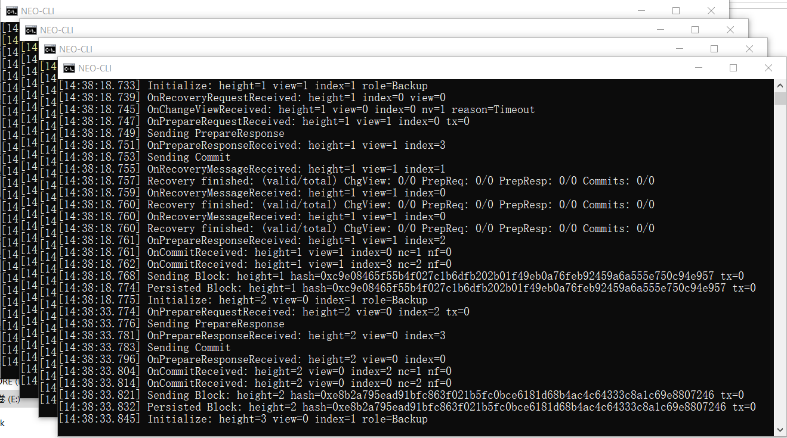
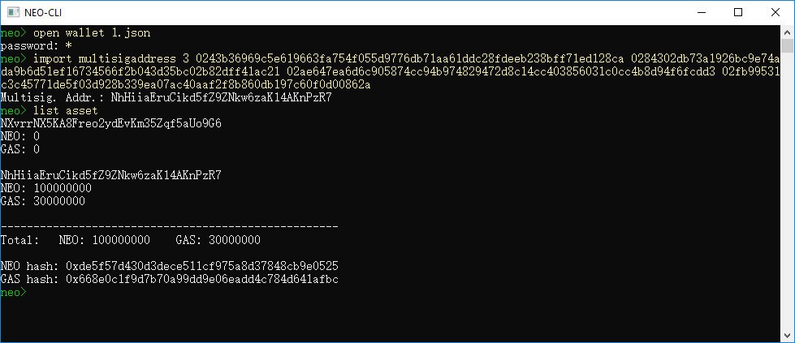
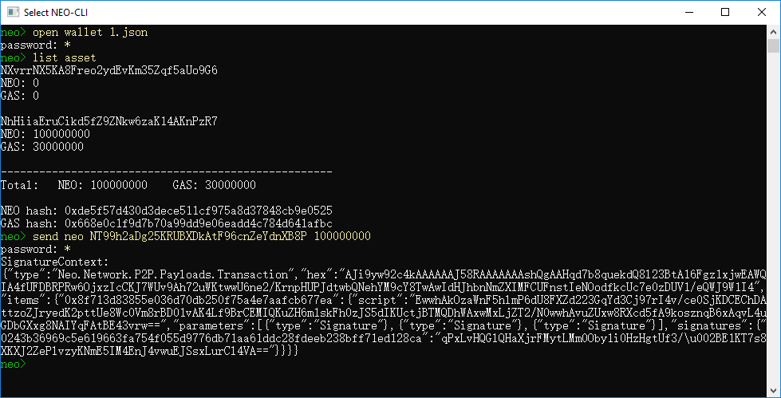
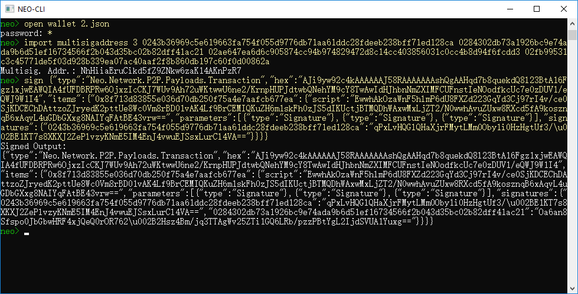
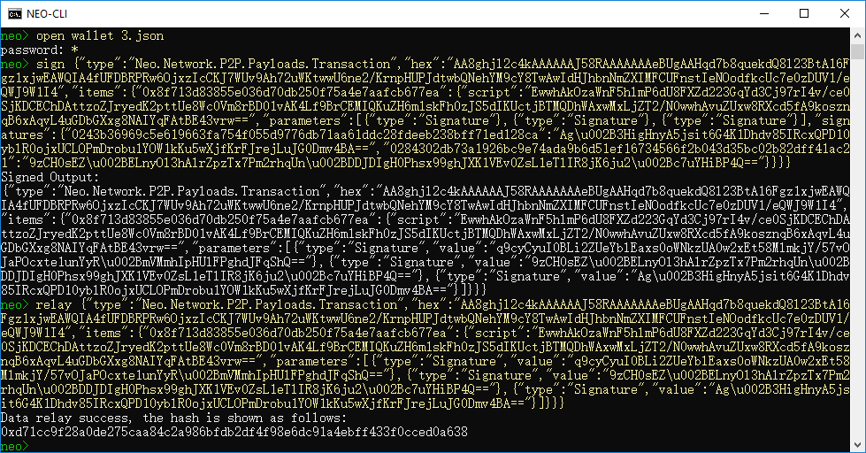

# 在本地主机搭建私有链

这篇文章我们将介绍如何在一台 Windows 系统的电脑上搭建私有链。

## 安装节点

首先安装 Neo-CLI，并将节点文件复制为 4 份，文件夹名分别命名为 node1、node2、node3、node4。

安装过程请参考 [Neo 节点的安装部署](../../node/cli/setup.md)。 

## 创建钱包文件

使用 Neo-CLI 或 Neo-GUI 创建四个不同的钱包文件，命名为 1.json、2.json、3.json、4.json，分别放置于四个节点的文件夹中。

## 修改 config.json

在每个节点下的 config.json 文件中进行如下修改：

- 设置每个端口不重复且不被其它程序占用。
- 设置 UnlockWallet 下的参数 `Path` 为钱包文件名，`Password` 为钱包密码。
- 设置 `StartConsensus` 和 `IsActive` 为 `true`。


可参照下面的配置：

**node1/config.json**

```json
{
  "ApplicationConfiguration": {
    "Logger": {
      "Path": "Logs_{0}",
      "ConsoleOutput": true,
      "Active": true
    },
    "Storage": {
      "Engine": "LevelDBStore"
    },
    "P2P": {
      "Port": 10003,
      "WsPort": 10004
    },
    "UnlockWallet": {
      "Path": "1.json",
      "Password": "1",
      "StartConsensus": true,
      "IsActive": true
    },
    "PluginURL": "https://github.com/neo-project/neo-modules/releases/download/v{1}/{0}.zip"
  }
}
```

**node2/config.json**

```json
{
  "ApplicationConfiguration": {
    "Logger": {
      "Path": "Logs_{0}",
      "ConsoleOutput": true,
      "Active": true
    },
    "Storage": {
      "Engine": "LevelDBStore"
    },
    "P2P": {
      "Port": 20003,
      "WsPort": 20004
    },
    "UnlockWallet": {
      "Path": "2.json",
      "Password": "1",
      "StartConsensus": true,
      "IsActive": true
    },
    "PluginURL": "https://github.com/neo-project/neo-modules/releases/download/v{1}/{0}.zip"
  }
}
```

**node3/config.json**

```json
{
  "ApplicationConfiguration": {
    "Logger": {
      "Path": "Logs_{0}",
      "ConsoleOutput": true,
      "Active": true
    },
    "Storage": {
      "Engine": "LevelDBStore"
    },
    "P2P": {
      "Port": 30003,
      "WsPort": 30004
    },
    "UnlockWallet": {
      "Path": "3.json",
      "Password": "1",
      "StartConsensus": true,
      "IsActive": true
    },
    "PluginURL": "https://github.com/neo-project/neo-modules/releases/download/v{1}/{0}.zip"
  }
}
```

**node4/config.json**

```json
{
  "ApplicationConfiguration": {
    "Logger": {
      "Path": "Logs_{0}",
      "ConsoleOutput": true,
      "Active": true
    },
    "Storage": {
      "Engine": "LevelDBStore"
    },
    "P2P": {
      "Port": 40003,
      "WsPort": 40004
    },
    "UnlockWallet": {
      "Path": "4.json",
      "Password": "1",
      "StartConsensus": true,
      "IsActive": true
    },
    "PluginURL": "https://github.com/neo-project/neo-modules/releases/download/v{1}/{0}.zip"
  }
}
```

> [!Note]
>
> 如果安装了 RpcServer 插件，需要修改插件的 config.json 中的端口号，使其互不相同，且与节点的 config.json 中端口号也互不相同。

## 修改 protocol.json

在每个节点下的 protocol.json 文件中，对以下参数进行修改，并保证所有节点的配置一致。

- Magic ：私有链 ID，可设置为 [0 - 4294967295] 区间内的任意整数。

- StandbyCommittee ：委员会成员节点的公钥，票数前4的即为共识节点，这里可以输入 4 个钱包的公钥。

- SeedList ：种子节点的 IP 地址和端口号，IP 地址设置为 localhost，端口为 config.json 中配置的 4 个 P2P Port。


可参照下面的配置：

```json
{
  "ProtocolConfiguration": {
    "Magic": 213123,
    "MillisecondsPerBlock": 5000,
    "ValidatorsCount": 4,
    "StandbyCommittee": [
      "0243b36969c5e619663fa754f055d9776db71aa61ddc28fdeeb238bff71ed128ca",
      "0284302db73a1926bc9e74ada9b6d51ef16734566f2b043d35bc02b82dff41ac21",
      "02ae647ea6d6c905874cc94b974829472d8c14cc403856031c0cc4b8d94f6fcdd3",
      "02fb99531c3c45771de5f03d928b339ea07ac40aaf2f8b860db197c60f0d00862a"
    ],
    "SeedList": [
    "localhost:10003",
    "localhost:20003",
    "localhost:30003",
    "localhost:40003"
    ]
  }
}
```

## 创建快捷启动

为了方便启动私链，创建一个记事本文件，输入以下命令：
```
start cmd /k "cd node1 &&ping localhost -n 3 > nul&& dotnet neo-cli.dll"
start cmd /k "cd node2 &&ping localhost -n 3 > nul&& dotnet neo-cli.dll"
start cmd /k "cd node3 &&ping localhost -n 3 > nul&& dotnet neo-cli.dll"
start cmd /k "cd node4 &&ping localhost -n 3 > nul&& dotnet neo-cli.dll"
```
然后重命名为 Run.cmd。将其复制到 4 个节点目录外的同级目录下。

到此，私有链已经搭建完成了，所有修改过的文件结构如下

```
├─Run.cmd
|
├─node1
│      1.json
│      config.json
│      protocol.json
│
├─node2
│      2.json
│      config.json
│      protocol.json
│
├─node3
│      3.json
│      config.json
│      protocol.json
│
└─node4
|      4.json
|      config.json
|      protocol.json
```

## 启动私有链

进入每个节点目录，双击 `Run.cmd`，如果控制台打印出共识信息并且区块高度增长表示私链成功搭建：



如果关闭所有窗口，将停止私有链。

## 提取 NEO 和 GAS

在 NEO 网络的创世块中存放着 1 亿份 NEO 和 3 千万 GAS，当私链搭建起来后，GAS 也将伴着新区块的生成而生成。你可以使用 Neo-CLI 从多方签名合约中提取出这部分 NEO 和 GAS 以便内部开发测试使用。

### 创建多方签名地址

1. 启动私链

2. 复制一个共识节点作为外部节点来进行操作

3. 在一个节点中使用命令 `import multisigaddress m pubkeys`，创建一个多方签名地址。

   这里设置最小签名数 m 为 3，pubkeys 为四个共识节点的公钥（见 protocal.json）。例如：

    ``` 
   import multisigaddress 3 0243b36969c5e619663fa754f055d9776db71aa61ddc28fdeeb238bff71ed128ca 0284302db73a1926bc9e74ada9b6d51ef16734566f2b043d35bc02b82dff41ac21 02ae647ea6d6c905874cc94b974829472d8c14cc403856031c0cc4b8d94f6fcdd3 02fb99531c3c45771de5f03d928b339ea07ac40aaf2f8b860db197c60f0d00862a
    ```

4. 在其它三个节点中重复步骤 2

5. 输入命令 `list asset`，可以看到合约地址中出现了 100,000,000 NEO 和 30,000,000 GAS。

   

> [!Note]
>
> 四个钱包中都必须创建多方签名地址才能成功完成转账交易的签名。


### 提取 NEO/GAS 到普通地址

接下来我们将 NEO 从合约地址转入普通地址：

1. 打开第一个钱包（1.json）使用命令 `send <id|alias> <address> <value>` 将 NEO 转入目标地址。

2. 复制 SignatureContext 内容并关闭钱包。

   

3. 打开第二个钱包（2.json）。

4. 使用步骤 2 中复制的内容输入命令 `sign <jsonObjectToSign>` 

5. 复制 Signed Output 内容并关闭钱包。

   

6. 打开第三个钱包（3.json）重复前面的签名步骤，然后就可以使用 `relay <jsonObjectToSign>` 广播交易完成签名。

   

7. 输入 `list asset` 查看钱包资产，可以看到 NEO 已经转入。

   

参考前面提取 NEO 进行的多方签名操作，同样可以提取 GAS 到目标地址。
