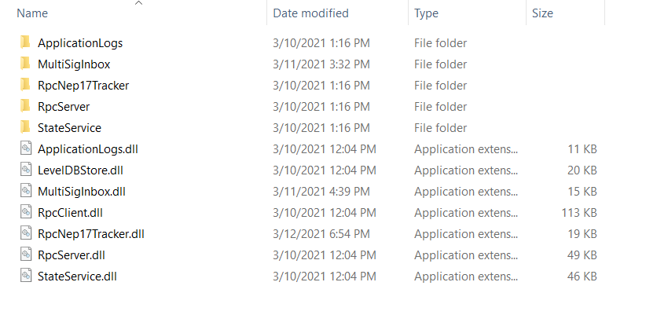

# 配置与启动节点

完成 Neo-CLI 的安装后，本节我们将进行启动前的必要配置以及使用命令启动节点。

## 修改配置文件

Neo-CLI 在执行过程中会访问配置文件 `config.json`。启动 Neo-CLI 前需要对该文件进行必要配置。

### 配置钱包

启动 Neo-CLI 前，你可以在 `config.json` 中开启自动绑定并打开钱包功能，这样节点启动后会默认打开该钱包。配置参数如下：

- `Path`：钱包路径
- `Password`：钱包密码
- `IsActive`：设为 true 允许自动打开钱包

下面是一个标准设置的例子：

```json
{
  "ApplicationConfiguration": {
    "Logger": {
      "Path": "Logs_{0}",
      "ConsoleOutput": false,
      "Active": false
    },
    "Storage": {
      "Engine": "LevelDBStore",
      "Path": "Data_LevelDB_{0}"
    },
    "P2P": {
      "Port": 20333,
      "WsPort": 20334
    },
    "UnlockWallet": {
      "Path": "",
      "Password": "",
      "IsActive": false
    },
    "PluginURL": "https://github.com/neo-project/neo-modules/releases/download/v{1}/{0}.zip"
  },
  "ProtocolConfiguration": {
    "Network": 844378958,
    "MillisecondsPerBlock": 15000,
    "MaxTraceableBlocks": 2102400,
    "ValidatorsCount": 7,
    "StandbyCommittee": [
      "023e9b32ea89b94d066e649b124fd50e396ee91369e8e2a6ae1b11c170d022256d",
      "03009b7540e10f2562e5fd8fac9eaec25166a58b26e412348ff5a86927bfac22a2",
      "02ba2c70f5996f357a43198705859fae2cfea13e1172962800772b3d588a9d4abd",
      "03408dcd416396f64783ac587ea1e1593c57d9fea880c8a6a1920e92a259477806",
      "02a7834be9b32e2981d157cb5bbd3acb42cfd11ea5c3b10224d7a44e98c5910f1b",
      "0214baf0ceea3a66f17e7e1e839ea25fd8bed6cd82e6bb6e68250189065f44ff01",
      "030205e9cefaea5a1dfc580af20c8d5aa2468bb0148f1a5e4605fc622c80e604ba"
    ],
    "SeedList": [
      "seed1t.neo.org:20333",
      "seed2t.neo.org:20333",
      "seed3t.neo.org:20333",
      "seed4t.neo.org:20333",
      "seed5t.neo.org:20333"
    ]
  }
}
```

说明：

- `ConsoleOutput` ：是否在控制台打印出 Log 信息。（true：前后台打印，false：后台记录）
- `Active` ：是否开启 Log 信息。
- `Engine` ：默认 LevelDBStore。表示区块链数据存储使用的引擎。
- `PluginURL`：表示下载插件的地址，使用 CLI 的 install 命令时会用到。

### 将节点连接到网络

将 Neo-CLI 连接到测试网需要配置 `config.json` 文件，用 `config.testnet.json` 中的内容去替换即可。如果你是从 [Neo node](https://github.com/neo-project/neo-node/releases) 直接下载的 RC3 程序包，那么其中的 `config.json` 文件已经是连接测试网的，无需替换。

> [!Note]
>
> 如果是从源代码发布的Neo-CLI，要成功连接到Neo N3 RC3测试网，还必须将配置文件 config.json 中的Network字段值改为 **844378958**。

如果要将节点接入私链，详细信息请参见 [搭建私有链](../../develop/network/private-chain/solo.md) 中的说明。 

## 安装插件

一些附加功能被独立封装在插件中用以调用，目的是为了提升节点的安全性，稳定性和灵活性。用户可以自行选取所需要的扩展功能而不用每次在启动 Neo-CLI 时通过附加参数来调用，避免了很多人为的失误操作同时简化了打开钱包，调用 API 等一系列繁琐的指令。

安装插件有两种方式：

- 从 GitHub 下载插件包
- 使用内部命令自动下载

### 从 GitHub 下载插件

下表列出了所有插件，选取所需要的插件进行下载。

<table class="table table-hover">
    <thead>
        <tr>
            <th style="width: 25%;">插件</th>
            <th style="width: 35%;">功能</th>
            <th style="width: 20%;">包含 API</th>
            <th style="width: 20%;"></th>
        </tr>
    </thead>
    <tbody>
        <tr>
            <td><a
                    href="https://github.com/neo-project/neo-modules/releases/download/v3.0.0-rc3/ApplicationLogs.zip">ApplicationLogs</a>
            </td>
            <td>同步智能合约和 NativeContract 的日志（Notify）</td>
            <td><a href="../../reference/rpc/latest-version/api/getapplicationlog.html">getapplicationlog</a></td>
            <td>推荐</td>
        </tr>
        <tr>
            <td><a
                    href="https://github.com/neo-project/neo-modules/releases/download/v3.0.0-rc3/DBFTPlugin.zip">DBFTPlugin</a>
            </td>
            <td>dBFT 共识插件</td>
            <td></td>
            <td>作为共识节点时必选</td>
        </tr>
        <tr>
            <td><a
                    href="https://github.com/neo-project/neo-modules/releases/download/v3.0.0-rc3/LevelDBStore.zip">LevelDBStore</a>
            </td>
            <td>区块链数据使用 LevelDB 存储引擎</td>
            <td></td>    
            <td>必选</td>
        </tr>
        <tr>
            <td><a
                    href="https://github.com/neo-project/neo-modules/releases/download/v3.0.0-rc3/OracleService.zip">OracleService</a>
            </td>
            <td>Oracle 服务插件</td>
            <td></td>
            <td>作为 Oracle 服务节点时必选</td>
        </tr>
        <tr>
            <td><a
                    href="https://github.com/neo-project/neo-modules/releases/download/v3.0.0-rc3/RocksDBStore.zip">RocksDBStore</a>
            </td>
            <td>区块链数据使用 RocksDBStore 存储引擎</td>
            <td></td>
            <td>和 LevelDBStore 二选一</td>
        </tr>
        <tr>
            <td><a
                    href="https://github.com/neo-project/neo-modules/releases/download/v3.0.0-rc3/RpcNep17Tracker.zip">RpcNep17Tracker</a>
            </td>
            <td>提供 NEP17 余额及交易历史的 RPC 查询功能。</td>
            <td><a href="../../reference/rpc/latest-version/api/getnep17balances.html">getnep17balances</a><br><a
                    href="../../reference/rpc/latest-version/api/getnep17transfers.html">getnep17transfers</a></td>
            <td>推荐</td>
        </tr>
        <tr>
            <td><a
                    href="https://github.com/neo-project/neo-modules/releases/download/v3.0.0-rc3/RpcServer.zip">RpcServer</a>
            </td>
            <td>提供节点的 RPC 功能</td>
            <td><a href="../../reference/rpc/latest-version/api.html#命令列表"> RPC API </a></td>
            <td>必选</td>
        </tr>
        <tr>
            <td><a
                    href="https://github.com/neo-project/neo-modules/releases/download/v3.0.0-rc3/StatesDumper.zip">StatesDumper</a>
            </td>
            <td>导出 Neo-CLI 状态数据</td>
            <td></td>
            <td>可选</td>
        </tr>
        </tr>   
         <tr>
            <td><a
                    href="https://github.com/neo-project/neo-modules/releases/download/v3.0.0-rc3/StateService.zip">StateService</a>
            </td>
            <td>StateRoot 共识服务插件</td>
            <td>
                <a href="../../reference/rpc/latest-version/api/getstateroot.html">getstateroot</a><br>
                <a href="../../reference/rpc/latest-version/api/getproof.html">getproof</a><br>
                <a href="../../reference/rpc/latest-version/api/verifyproof.html">verifyproof</a><br>
                <a href="../../reference/rpc/latest-version/api/getstateheight.html">getstateheight</a>
            </td>
            <td>作为 StateRoot 共识节点时必选</td>
        </tr>   
    </tbody>
</table>
将下载的插件包解压到 neo-cli 根目录下，解压完成后的目录结构应如下图。



### 使用命令下载插件

使用内部命令自动下载或卸载插件，操作更为简便。例如：

```
neo> install StatesDumper
Downloading from https://github.com/neo-project/neo-modules/releases/download/v3.0.0-rc3/StatesDumper.zip
Install successful, please restart neo-cli.
```

```
neo> uninstall StatesDumper
Uninstall successful, please restart neo-cli.
```

在安装或卸载完毕后，请重启 Neo-CLI 使操作生效。

## 启动 Neo 节点

打开命令行，定位到 Neo-CLI 所在目录，输入以下命令启动 Neo 节点 。

**Windows 10**:

```
dotnet neo-cli.dll
```

或

```
neo-cli.exe
```

**Linux (ubuntu 16.04/18.04)**:

```
./neo-cli
```

或

```
dotnet neo-cli.dll
```

> [!Note]
>
> 如果使用 dotnet，需要先安装 .net core 环境。


如果你想让外部程序访问该节点的 API 需要开放防火墙端口：10331-10334, 20331-20334 

> [!WARNING]
>
> 如果开通了 API 服务，并且在 Neo-CLI 中打开钱包的话，需要设置防火墙策略，例如设置防火墙的白名单，这些端口仅对白名单的 IP 地址开放。如果完全对外开放，其它人可能会通过 API 导出私钥或者进行转账。

