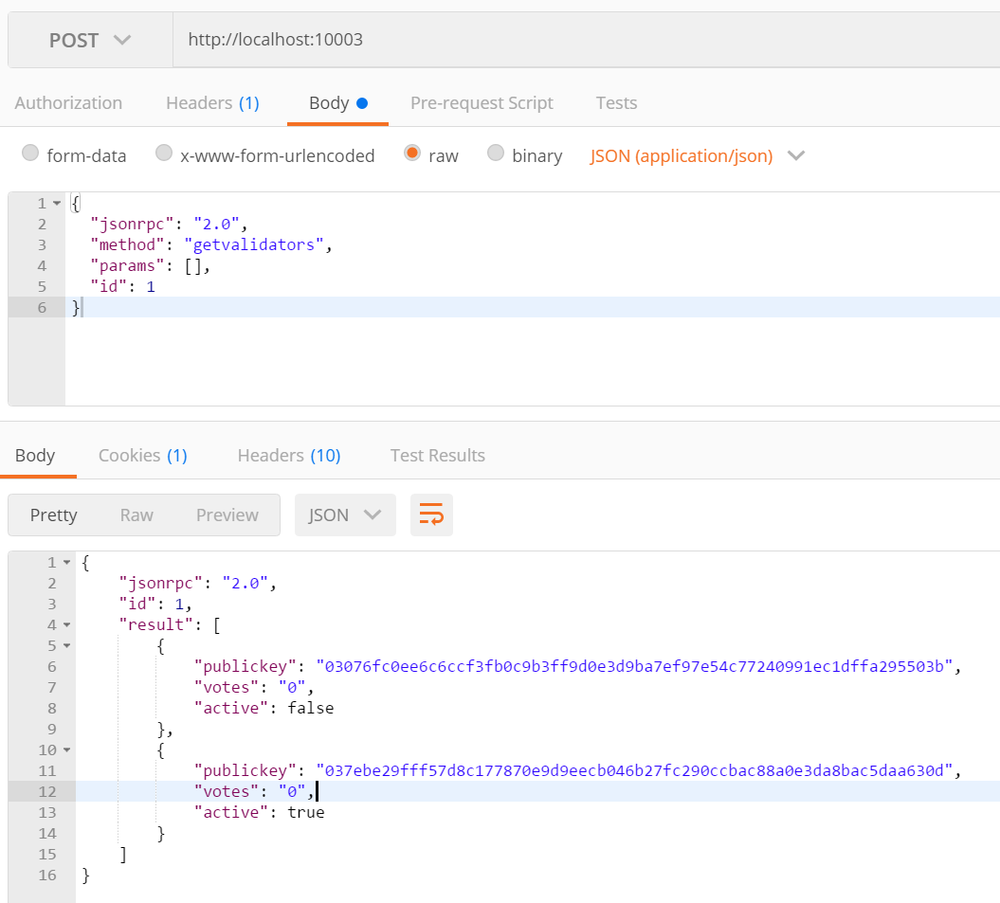

# 高级

Neo-GUI 的高级模块包括：

- [选举](#选举)
- [投票](#投票)
- [签名](#签名)
- [构造交易](#构造交易)
- [数据转换](#数据转换)
- [插件管理](#插件管理)

## 选举

使用 Neo-GUI 可以报名成为共识节点的候选人，也可以对候选节点进行投票。Neo 共识节点将通过 dBFT 算法达成共识，生成新的区块。投票在 Neo 网络实时持续进行，其流程大致为：

1. 报名成为候选人
2. NEO 持有者对候选人进行投票
3. 根据投票数和候选人数计算选出共识节点

在 Neo-GUI 中选举非常简单，选择自己的公钥，确认选举即可。

选举将会消耗一定的 GAS，选举后将成为候选人。

可以使用 API [getvalidators](../../reference/rpc/latest-version/api/getvalidators.html) 查看是否成功成为候选人，候选人公钥会显示在该 API 的响应正文中 （publickey）：

也可以在官网的 [共识节点页面](https://neo.org/consensus) 查看现有的共识节点和候选节点。

## 投票

在 Neo-GUI 中投票的流程如下：

1. 选择自己的地址
2. 选择要为其投票的公钥列表（可多选）
3. 确认投票

确认投票后，当前地址中的所有 NEO 会作为票数。假设 NEO 的数量为 n，则每个候选人（公钥）的票数都为 n。

投票成功后可以使用 API [getvalidators](../../reference/rpc/latest-version/api/getvalidators.html) 查看候选人票数。如下图所示，从余额为 100000000 的账户投票给候选人（公钥 03076fc0ee6c6ccf3fb0c9b3ff9d0e3d9ba7ef97e54c77240991ec1dffa295503b）， 通过 API getvalidators 可以查看到返回的响应正文中显示出该公钥与对应的的票数。

也可以在官网的 [共识节点页面](https://neo.org/consensus) 查看现有的共识节点和候选节点的票数。

## 签名

暂未上线，敬请期待。

## 构造交易

暂未上线，敬请期待。

## 数据转换

暂未上线，敬请期待。

## 插件管理

暂未上线，敬请期待。