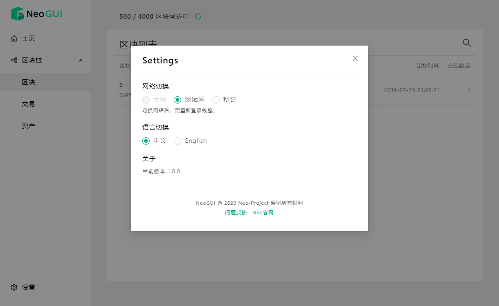

# 安装 Neo-GUI

Neo-GUI 是 Neo 区块链上的全节点的应用程序，采用 Electron 跨平台技术，可在 Windows 10、macOS、Linux 系统上运行。

其主要功能如下；

- 查看与搜索区块链信息
- 钱包基本操作，包括创建钱包、导入钱包、转账交易等
- 部署与调用智能合约
- 选举与投票共识节点

## 下载与安装

Neo-GUI 是一个开源项目，可在 [GitHub](https://github.com/neo-ngd/Neo3-GUI/releases) 上下载对应系统版本的安装包，根据安装提示完成安装即可。

> [!Note]
>
> 请确认你的 Windows 系统已安装 [.NET Core 3.1](https://dotnet.microsoft.com/download/dotnet-core/current/runtime) 。

## 连接网络

完成安装后，需要将Neo-GUI接入Neo测试网或搭建好的私链。

### 连接到测试网

1. 启动Neo-GUI ，进入任意页面，点击左下角设置。

2. 在**网络切换**中选择 `测试网`。

   

稍等片刻可以看到开始同步高度，表示成功接入网络。

### 连接到私链

如果已经搭建好自己的私链（参见[搭建私链](../../network/private-chain/solo.md)），请按照以下操作进行：

1. 复制私链对应的 config.json 和 protocol.json 文件

   请确保 protocal.json 里 SeedList 配置的地址端口可以被本机访问到；

2. 打开Neo-GUI安装目录下的 “resources\build-neo-node” 目录，找到 config.private.json 和 protocol.private.json 两个文件；

3. 用步骤1私链的 config.json 和 protocol.json 内容分别替换 config.private.json 和 protocol.private.json 的内容；

4. 启动 Neo-GUI ，进入任意页面，点击左下角`设置`。

5. 在**网络切换**中选择 `私链`。

稍等片刻可以看到开始同步高度，表示成功接入网络。