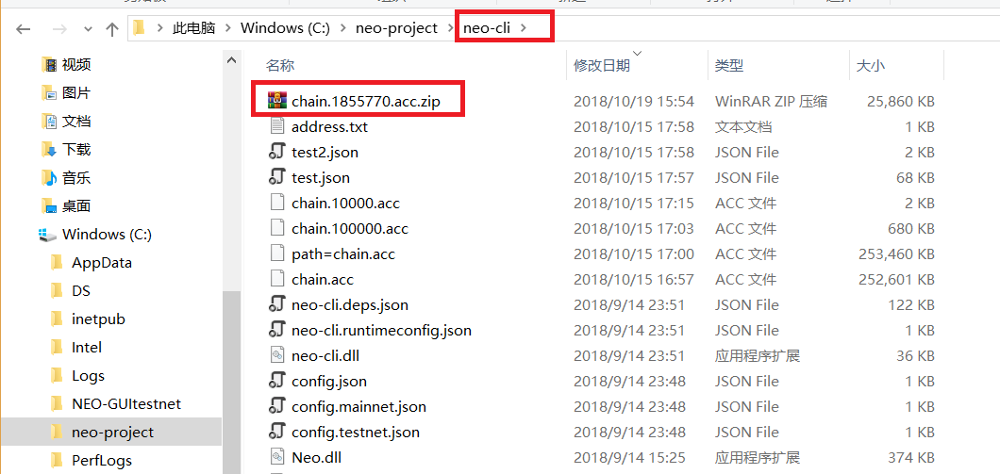
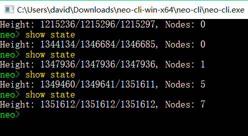

# Synchronizing the blockchain faster

The client must be fully synchronized before use. In order to speed up network synchronization you can download an offline package of the blockchain data up to a certain block height. This means the client will only need to sync the additional blocks from the NEO network rather than the entire blockchain.

> [!Note]
>
> Before the NEO client can synchronize block data with the offline package, you must install the [ImportBlocks](https://github.com/neo-project/neo-plugins/releases/download/v2.9.4/ImportBlocks.zip) plugin:
>
> 1. Download [ImportBlocks](https://github.com/neo-project/neo-plugins/releases/download/v2.9.4/ImportBlocks.zip) and unzip it.
> 2. Create a new Plugins folder (The first letter is capitalized) under the client root directory and copy the unzipped plugin into it.
>
> Alternatively (for NEO-CLI 2.9.4 and later versions) you can use the "install ImportBlocks" command to automatically install the plugin.
>

## Step 1 - Download the offline package

1. Close the NEO client and go to [offline synchronized package](http://sync.ngd.network/) downloading page.

2. From the offline package downloading page, click **Mainnet** or **Testnet** according to your network and then download one of the following packages (no need to unzip the package):

   - **Full offline package**: contains the most complete blockchain data. It is applicable to the client running for the first time. The download file is chain.0.acc.zip.
   - **Increment offline package**: contains data in the range from starting height to ending height of the package. It is applicable to the client which has been synchronized up to the block height within the increment offline package coverage. The download file is chain.xxx.acc.zip, where xxx is the package starting height, e.g. chain.1855770.acc.zip.

   

## Step 2 - Place the offline package

Place the downloaded package (chain.0.acc.zip or chain.xxx.acc.zip) under the folder where the client executive program (neo-gui.exe or neo-cli.exe) is located. 

> [!Warning]
>
> You must not change the default offline package file name  (chain.acc.zip or chain.xxx.acc.zip) , otherwise it will not work for synchronization.

## Step 3 - Check the client synchronization status

Run the client again and check the blocks downloading status：

- For NEO-GUI，You can see the client is now synchronized up to a certain point and the client will now continue synchronizing the rest of the blockchain. The data beside "Height" corresponds to wallet height/synchronized blockchain height/blockchain header height. 

- For NEO-CLI，enter  `open wallet <path>` to open a wallet, and then enter  `show state` to check the blocks downloading status. When you see the connected nodes is 0 and the synchronizing speed is greatly accelerated, that means the offline package is working. When the three values after "Height" get to the same, it indicates the synchronization is almost completed.

  

> [!Note]
>
> - For NEO-CLI clients earlier than 2.9.0, the client cannot be reached as it is synchronizing with the offline package, thus the connected nodes is 0 and you cannot invoke APIs from the client until it has completed synchronization.
> - You can also use the NEO-CLI command `export blocks`, to export the entire blockchain data to a package or export the specified number of block data from the specified block height . For more information,  see [CLI Command Line](../node/cli/cli.md).
