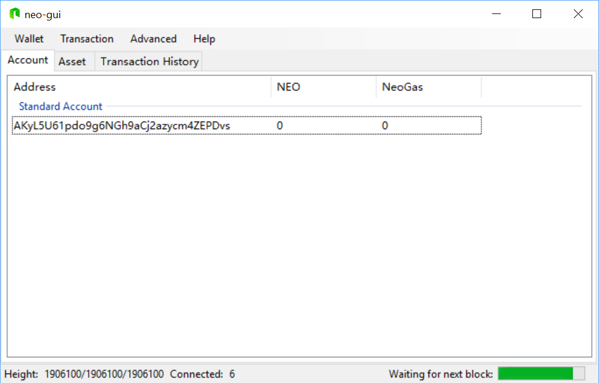

# Synchronizing the blockchain faster

The client must be fully synchronized before use. In order to speed up network synchronization you can download an offline package of the blockchain data up to a certain block height.  This means the client will only need to sync the additional blocks from the NEO network rather than the entire blockchain. 

Suppose you are using windows, you need to do the following:

1. Close the NEO client and click [Download offline synchronized package](http://sync.ngd.network/) from the [Client Downloads](https://neo.org/download) page.

2. Download the full offline package or increment offline package according to your network.

   - For the full offline package, place it under the folder where the client executive program (neo-gui.exe or neo-cli.exe) is located. 
   - For the increment offline package, first you need to synchronize the client to the starting height of the increment offline package and then place the unzipped package under the neo-gui.exe or neo-cli.exe folder.

3. Run the client and check the blocks downloading status.

   - For NEO-GUI，You can see the client is now synchronized up to a certain point and the client will now continue synchronizing the rest of the blockchain. The data beside "Height" corresponds to wallet height/synchronized blockchain height/blockchain header height. 

   

   - For NEO-CLI，enter  `open wallet <path>` to open a wallet, and then enter  `show state` to check the blocks downloading status. When you see the connected nodes is 0 and the synchronizing speed is greatly accelerated, that means the offline package is working. When the three values after "Height" get to the same, it indicates the synchronization is almost completed.

     

You can also use the NEO-CLI command `export blocks`, to export the entire blockchain data to a package or export the specified number of block data from the specified block height . For more information,  see [CLI Command Line](../node/cli/cli.md).