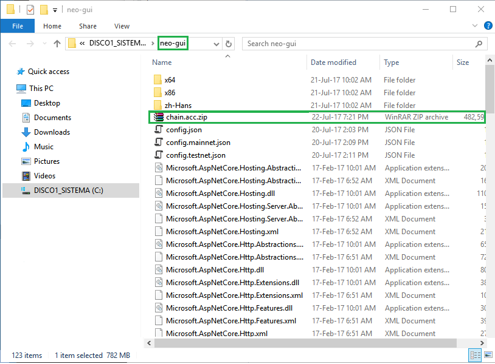
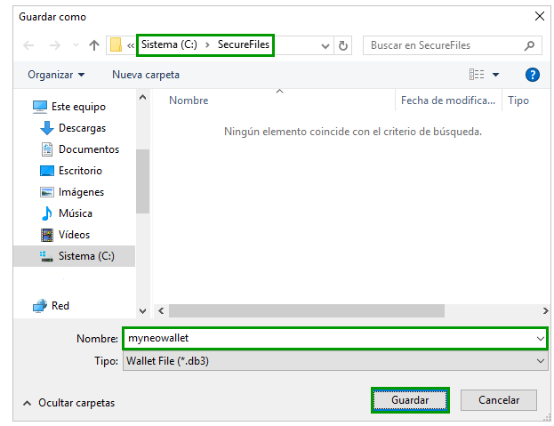
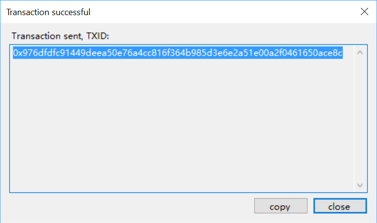
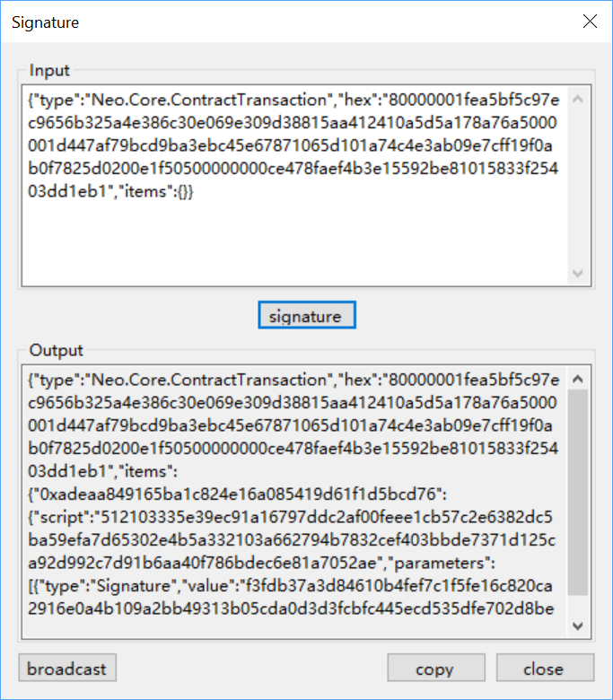
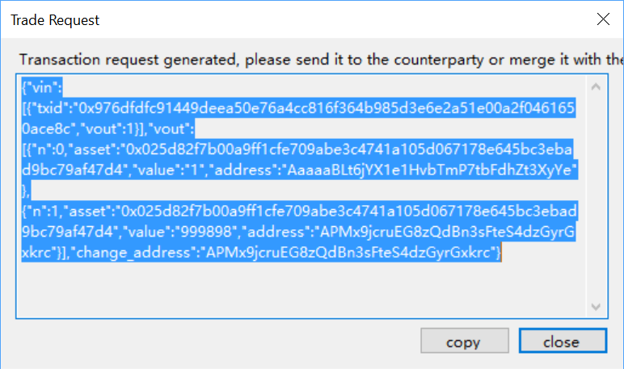
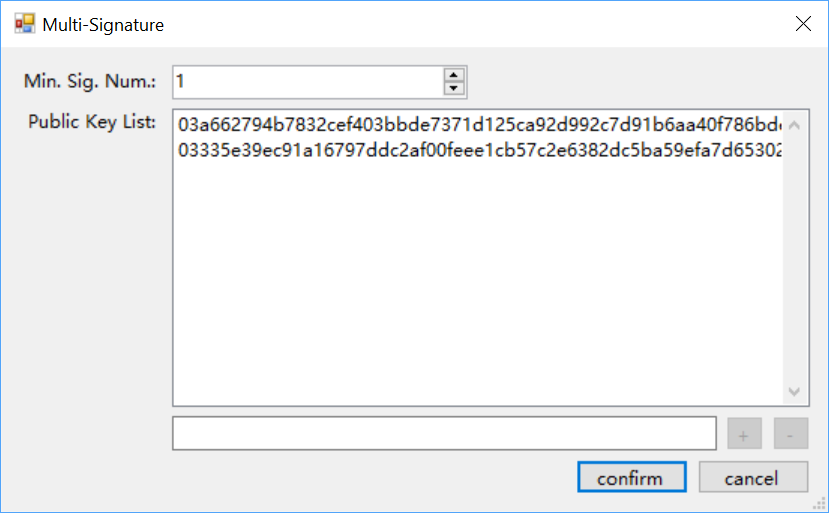
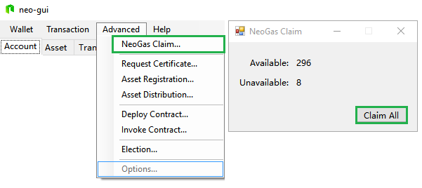
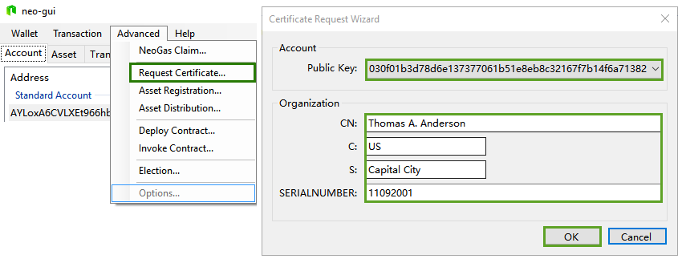

# Using the NEO-GUI Client

> [!Note]
>
> Unless otherwise stated,  this article introduces the NEO-GUI running on the test net. For more information, refer to [Test Network](../network/testnet.md).

## Downloading the client

Download [NEO-GUI](https://neo.org/download) and extract the files to a location of your choice, then double-click neo-gui.exe to run the client. If there are any problems with the process and the client cannot be used normally, please keep the error.log file located in the same directory as neo-gui, then contact our technical staff to assist you in solving the problem.

> [!Note]
>
> The NEO-GUI client is compatible with the following versions of Windows: Windows 7 (Service Pack 1) / Windows 8 / Windows 10.
>
> Pre-Windows 10 systems require [.NET Framework 4.6.2](https://www.microsoft.com/net/download/framework) to be installed.

## Synchronizing blockchain data

The client must be fully synchronized before use. The data beside "Height" corresponds to wallet height/synchronized blockchain height/blockchain header height. When you open a wallet, the wallet height data is displayed.  These numbers update regularly.

In order to speed up network synchronization you can download an offline package of the blockchain data up to a certain block height.  This means the client will only need to sync the additional blocks from the NEO network rather than the entire blockchain.

1. To begin, download the package located at [Client Downloads](https://neo.org/download) according to your network: chain.acc.zip for main net or chain.acc.test.zip for test net.

2. Close the neo-gui client and copy chain.acc.zip to the neo-gui folder as shown in the figure below:

   

   > [!Note]
   >
   > For the test net package chain.acc.test.zip, you need to rename the file to chain.acc.zip before placement.

3. Re-open the neo-gui client, you can see the client is now synchronized up to a certain point and the client will now continue synchronizing the rest of the blockchain.   

You can also use the NEO-CLI command `export blocks` to export the synchronized block data to a package. For more information,  see  [CLI Command Reference](cli/cli.md).

## Wallet
A wallet file, with the .json or .db3 extension, stores a reference to your NEO, GAS, and account information in a database. This file is very important and must be backed up securely.

> [!Important]
>
> Loss of either the wallet file or wallet password will result in the loss of your assets. Please ensure that the wallet file is securely stored and remember the wallet password.

### Creating the wallet database

1. Click `Wallet`, `New Wallet Database`.

   

2. Click `Browse` to select the wallet file storage location, and set the file name, and then click Save.

   

3. Enter `Password` and `Re-Password` and save your own password.

   

4. Click `OK` and the wallet is successfully created, which by default comes with a standard account. 

   > [!Note]
   >
   > Due to the role of change mechanism, the remainder of the assets is transferred to the first address by default. Thus, there is a need to back up the corresponding private key and wallet.

### Viewing the wallet information

#### Account

Right-click on the account and select `View Private Key` to check the account information:

- Address: The equivalent of a bank account or bank card number, used to receive assets during transactions.

- Private key: A 256-bit random number, kept by the user and not known publicly. This represents the user account ownership and the ownership of the assets within the account.

- Public key: Each private key has a matching public key (Note: Public key, and private key information can be viewed by right clicking on the address.)

> [!Important]
>
> At no point should the private key be disclosed to others. Once the private key is disclosed, it may result in the loss of your assets.

You can also do the following operations by right-clicking an address of the account:

| Function          | Description                                                  |
| ----------------- | ------------------------------------------------------------ |
| Create New Add.   | Creates a new address in the wallet                          |
| Import            | `Import from WIF`: Imports the corresponding address into the wallet `Import from Certificate:` Imports the certification  `Import Watch-Only Address`：After importing the address of the other party as the watch-only address, you can monitor the assets at that address. |
| Copy to Clipboard | Copies the address                                           |
| Delete            | Removes the address                                          |

#### Assets

Clicking on the `Asset` tab you can view the assets of the account, including Assets (NEO, GAS, the user-created assets), type, balance, and the issuer.

#### Transaction History

Clicking on the `Transaction History` tab you can view all the transaction records associated with the wallet.

### Opening the wallet database

1. Every time the client is re-opened, you need to click `open wallet database` to select which wallet file to open, as the picture shows:

   

2. Click `Browse` to select the wallet (usually the default is the last open wallet)

3. Select one of the file format to open: NEP-6 (.json) or SQLite (.db3)

   Clients earlier than Neo GUI v2.5.2 support only .db3 files.

4. Enter the password, and click `OK` to enter the wallet.

5. If opening an old .db3 wallet, you need to choose whether to upgrade the wallet to the new NEP-6 format according to the prompted message.

   After upgraded, the NEP-6 wallet can be shared among multiple clients, e.g. mobile, PC, or Web site. But it cannot be opened in the  clients earlier than Neo GUI v2.5.2.

### Changing password

You can modify the wallet password.

After changing the password, please remember to backup wallet again as any previous wallet backups will not contain the new password.

### Rebuild the wallet index

This option is used to restore errors in the client when an exception occurs. The Wallet Index may need to be rebuilt in the following cases:

- After the import of a private key.
- A transaction that has not been confirmed after a long time.
- The wallet assets show errors and blockchain data does not match.
- Switching between the main net and test net.

As the current block height is very high, rebuilding the wallet index can take several minutes. Please be patient.

## Transactions

### Transfer

Transfers assets to a recipient address. If the transferred asset type is equity, both parties are required to confirm with their signature.

1. From NEO-GUI, click  `Transaction`-> `Transfer`

2. Do one of the following:

   1. To transfer to a single address, click  `+` and enter the transfer information, e.g. assets type, recipient address, and amount.
   2. To transfer to a batch of addresses, click  and enter pairs of the address and amount separated by a space, as shown below: 

   

3. Click `OK`. If need be, click   to enter transaction related information that will be recorded on the NEO blockchain.  

4. Double-check the transfer information and then click `OK`.

   For token asset transfer, the transaction is completed with the transaction ID displayed.

   

   For equity asset transfer, signatures are required for completing the transaction. Copy the  transaction information that appears and send it to the other party. The other party of the transaction needs to sign and broadcast in NEO-GUI to complete the transaction. For more information, refer to [Signature](#Signature).

### Signature

Signing of information, is to signify confirmation of the information by the signer.
For transactions involving equity allocation and asset exchange, the signature is required as proof of consent by the parties involved.

1. From NEO-GUI, click `Transaction` -> `Sign`,

2. Paste the transaction information sent by the other party in the input field, and then click `sign`. The output data is generated. 

   At the same time, the `Broadcast` button is displayed.

   

3. Click  `Broadcast`. The transaction is sent successfully and will be completed once confirmed by NEO blockchain.

### Assets Exchange

An online asset exchange between two parties require both parties to sign for the transaction before the successful exchange of asset can occur. For example, a general asset exchange process between the transaction parties A and B is:

1. Both parties initiate a transaction request and send the generated request to each other
2. Verify the request received
3. Merge transaction requests from both parties, generate signatures and send them to each other
4. Sign and broadcast the transaction.

#### Step 1 - Initiating a request

Take the operations made on A side as an example:

1. From NEO-GUI, click `Transaction` -> `Transaction`.

2. Enter the other party's account information and then click `+` to enter the asset to be sent.

3. Click `Initiate` to generate the transaction request. Cope the request that appears and send it to B. Then click `Close`.

   

4. The merging request page is displayed. Wait for the transaction request sent from B.

   B performs the same operations and send the request to A.

#### Step 2 - Merging the request

Take the operations made on A side as an example:

1. In the merging request page, paste the request sent from B into the counterparty request field. Click `Validate`.

   

2. Verify the transaction information. Click `Accept` if no issue.

3. Click `Merge` to merge both parties' requests and generate the signature.

4. Copy the signature information and send it to B.

5. B performs the same operations and send the signature to A.

#### Step 3 - Signing and broadcasting the transaction

The two sides sign and broadcast the transaction information to complete the process. For more information, refer to [signature](#sign).

## Advanced Features

### Multi-party signed address

Multi-party signed address is a contract address that requires one or more parties to sign during the process of transaction.

To create a multi-party signed address:

1. From NEO-GUI, right-click on the account area and select `Create Contract Address` -> `Multi-Signature`.

2. In the public key list, enter the public keys used for signing.

3. Specify the minimal number of signatures.

   

4. Click OK.

The contract address is created and displayed in the account page.

### Claiming GAS

GAS is generated with each new block and will be allocated to the address of NEO holders. (The number within the brackets of the balance of assets is the number of GAS that can be claimed) At any time, the NEO holder can initiate a claim to redeem these GAS to the corresponding address of the NEO. At the moment, only the PC version of the client has the functionality to extract GAS.

The specific steps are:

1. Transfer all the NEO within the wallet using a transfer operation. (It is possible to send the NEO straight to the current address) Once the claim for the GAS is settled, the GAS can be withdrawn. (Refer to the white paper for technical explanation of this process).
2. Click `Advanced`, `Claim GAS`, `Claim All`.

### Requesting a certificate

Note that this feature can only generate a certificate application file, the user will still need to go to the relevant digital certificate authority to apply for a certificate.
Click `Advanced`, `Request certificate`, and fill in the request form according to the instructions given.

The generated file will be as shown in the following figure:

### Registering assets

You can create a new asset type in the NEO blockchain, defining the type, name, total amount, and the administrator account of the asset. Currently creating an asset costs 4990 GAS as an additional service fee. 

There are two types of assets, Token and Share. Taking Token assets as an example, do the following to create the asset:

1. From NEO-GUI, click `Advanced` -> `Asset Registration`. Specify the following options and click `OK`：

   - Asset Type: Choose the asset type: Token or Share.  For share asset transfer, signature is required.

   - Name: The asset name. It will be displayed in the Asset page of neo-gui and the blockchain browser after the asset distributed. 

   - Capped: Check this option to set the maximum amount of the asset issued.

   - Precision: The minimum unit of the asset. The default is 8, indicating the minimum unit is 0.00000001. If it is 0, the minimum unit is 0.

   - Owner: The asset issuer.

   - Admin: An administrator can modify the asset name, the total amount and so on. The feature is not supported yet.

   - Issuer: The address of the asset to be distributed.

     

2. Assets registration is implemented by invoking the smart contract. In the Invoke Contract page, click `Test` . 

   You can see the corresponding service fee is shown up in the lower-left corner of the page.

   You can also load your local smart contract files.

   > [!Note]
   >
   > The assets registration incurs a significant fee (Currently it is 4990 Gas) .

3. If you are sure to continue, click `Invoke`.

4. Copy the transaction ID returned and paste it into Notepad for later use in asset distribution.

   > [!Note]
   >
   > It takes about 15 minutes to register before you can distribute assets.

### Distributing assets

Within the upper limits of the total amount set by the asset creator, the asset can be issued to the address specified by the issuer. Distributing assets requires a certain amount of GAS to be used as an additional service fee, currently 1 Gas per time.

1. From NEO-GUI, click `Advanced` -> `Asset Distribution`.

2. Paste the transaction ID obtained in the last step of registering assets into `Asset ID`, the asset details is displayed automatically.

   If the transaction ID starts with "0x", you need to delete "0x" and enter it again.

3. Click `+` to enter the account address and the amount of assets to be distributed. Click `OK`.

   Once the distribution is complete, you can see the user-created assets is displayed in your wallet.

### NEP-5 Assets

The NEO-GUI client supports NEP-5 assets transactions. To make a NEP-5 asset transaction, you first need to click `Advanced` -> `Options` in the client to add a script hash for the NEP-5 asset. Then you can select the NEP-5 asset type for asset transfer and exchange transactions.

### Election

This function is used to register as a NEO blockchain validator candidate.

It should be noted that the election incurs a significant fee. (The main network fee is 1000 GAS, test network fee is 10 GAS) Please exercise caution. The validator function is not available yet, please wait for further updates.
