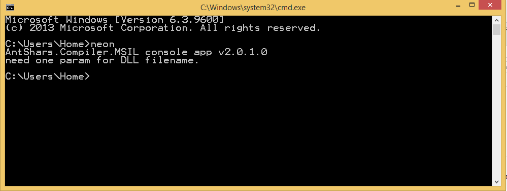
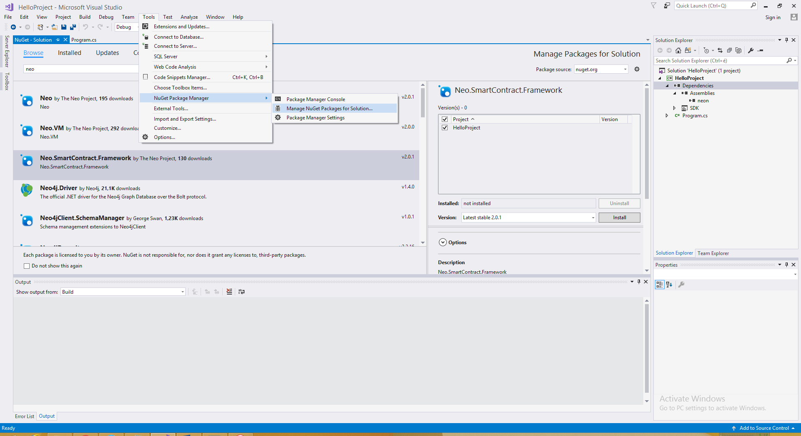
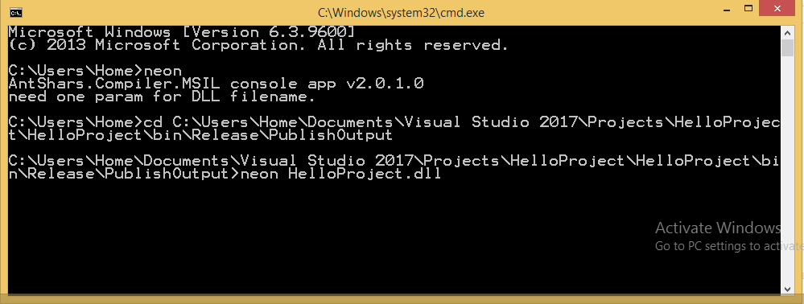

### How to use C# to write an AntShares smart contract

We currently recommend C# for developing smart contracts (though we support or plan to support Java, Kotlin, Go, C/C++, Python, JavaScript and other programming languages)

This section contains a short tutorial that guides you in configuring the C# development environment for AntShares smart contracts and gives you an idea of ​​how to create a smart contract project and how to compile it.

   > [!Note]
   > At present, all the projects have been upgraded to the Visual Studio 2017 version, if you want to use Visual Studio 2015 to create intelligent contracts can refer to [how to use C # to write ants intelligent contract for VS2015](getting-started-2015.md)

## Development Tools

### 1. Visual Studio 2017

If you have already installed Visual Studio 2017 on your computer and checked for .NET .NET Cross-Platform Development at the time of installation, you can skip this section.

Download and install:

[Visual Studio download address](https://www.visualstudio.com/products/visual-studio-community-vs)

The installation process is very simple, follow the operation prompts step-by-step, it should be noted that you need to check the installation of `.NET Core cross-platform development`, otherwise you will not be able to open AntShares.VM project in step #3. The installation takes about ten minutes or up to an hour.

## Smart contract development process

### 1. Download and clone neo-compiler 

In Team explorer Click Clone and insert the neo-compiler's link: https://github.com/neo-project/neo-compiler

Click Clone.

Double click on neo-compiler.sln

 
Click Solution explorer:

### 2. Neon 

Right click on ’neon’ and select Publish

 
Click on Publish.

Check your Output window:

After the release is successful, the neon.exe file is generated in bin\Release\PublishOutput.

We now need to add this directory to our execution path. The PATH is the system variable that your operating system uses to locate needed executables from the command line or Terminal window.

**Windows 10 and Windows 8:**

  In Search, search for and then select: System (Control Panel)
  Click the Advanced system settings link.
  Click Environment Variables. In the section System Variables, find the PATH environment variable and select it. Click Edit. If the PATH environment variable does not exist, click New.
  In the Edit System Variable (or New System Variable) window, specify the value of the PATH environment variable. Click OK. Close all remaining windows by clicking OK.

**Windows 7:**

  From the desktop, right click the Computer icon.
  Choose Properties from the context menu.
  Click the Advanced system settings link.
  Click Environment Variables. In the section System Variables, find the PATH environment variable and select it. Click Edit. If the PATH environment variable does not exist, click New.
  In the Edit System Variable (or New System Variable) window, specify the value of the PATH environment variable. Click OK. Close all remaining windows by clicking OK.

Now run Command or PowerShell, and enter neon. If there is no error and the output shows the version number (as shown) the environment variable configuration is successful.

NOTE. Windows 7 SP1 users might encounter an error "Unhandled Exception: System.DllNotFoundException: Unable to load DLL 'api-ms-win-core-console-l2-1-0.dll': The specified module could not be found". The required 'api-ms-win-core-console-l2-1-0.dll' file is only found in Windows 8 or later versions. This error can be resolved by obtaining a copy of 'api-ms-win-core-console-l2-1-0.dll' and putting it in the directory C:\Windows\System32.

### 3. Create project 

Create a new project in Visual Studio 2017: File->New->Project

    

Select Console App (.NET Core) and type ’HelloProject’ in the Name field. Then click OK.

Right click on Dependencies:

 
Add reference. Click Browse, and select and add neon.dll

Navigate to NuGet package manager:

Click Browse, then select and Neo.SmartContract.Framework.
 

We can insert our Hello world code:

### 4. Compile project 

Build the project, then Publish::
 
 
 

Navigate to the directory whick contains .dll file:

To compile it, type: neon HelloProject.dll

 

  
Now we get the .avm file:

Now that you have completed the configuration of the AntShares smart contract development environment, please refer to the [AntShares smart contract tutorial](tutorial.md)

