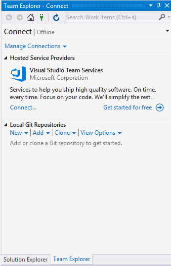

### How to use C# to write an AntShares smart contract

We currently recommend C# for developing smart contracts (though we support or plan to support Java, Kotlin, Go, C/C++, Python, JavaScript and other programming languages)

This section contains a short tutorial that guides you in configuring the C# development environment for AntShares smart contracts and gives you an idea of ​​how to create a smart contract project and how to compile it.

   > [!Note]
   > At present, all the projects have been upgraded to the Visual Studio 2017 version, if you want to use Visual Studio 2015 to create intelligent contracts can refer to [how to use C # to write ants intelligent contract for VS2015](getting-started-2015.md)

## Development Tools

### 1. Visual Studio 2017

If you have already installed Visual Studio 2017 on your computer and checked for .NET .NET Cross-Platform Development at the time of installation, you can skip this section.

Download and install:

[Visual Studio download address](https://www.visualstudio.com/products/visual-studio-community-vs)

The installation process is very simple, follow the operation prompts step-by-step, it should be noted that you need to check the installation of `.NET Core cross-platform development`, otherwise you will not be able to open AntShares.VM project in step #3. The installation takes about ten minutes or up to an hour.

------------------------------------------------------------------------------------------------------------------------------
------------------------------------------------------------------------------------------------------------------------------

Create NEO Smart Contract in Visual Studio 2017

1. Open Visual Studio.

2. In Team explorer Click Clone and insert the neo-compiler link: https://github.com/neo-project/neo-compiler

3. Create the Git repo by clicking Clone

4. Double click on neo-compiler.sln

 
5. Click Solution explorer:

 
6. Right click on ’neon’ and select Publish

 
7. Click on Publish.

8. Check your Output window:

  
9. Navigate to your directory (Target Location), where you can find neon.exe:

10. You have to add this directory path to the PATH environment variable:

11. We can check how it works. Run cmd and type ’neon’:

12. Now create a new project in Visual Studio 2017:

	File->New->Project
    

Select Console App (.NET Core) and type ’HelloProject’ in the Name field. Then click OK.

13. Right click on Dependencies:

 
14. Add reference. Click Browse, and select neon.dll

Add it. Then OK.

15. Navigate to NuGet package manager:

16. Click Browse and select Neo.SmartContract.Framework. Then click Install.
 

17. Now we can insert our Hello world code:

 
18. Build the project:

 

 
19. Publish:
 

20.  Navigate to the directory whick contains .dll file:

21. Compile it, type: neon HelloProject.dll

 

  
Now we get the .avm file:

