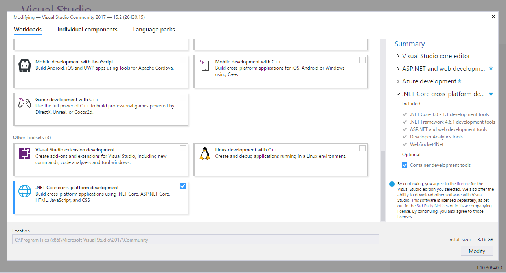
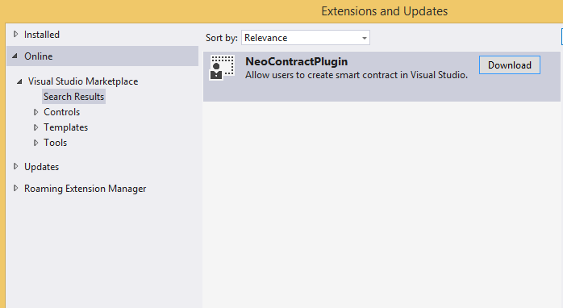
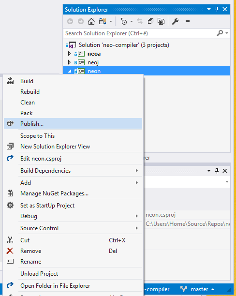
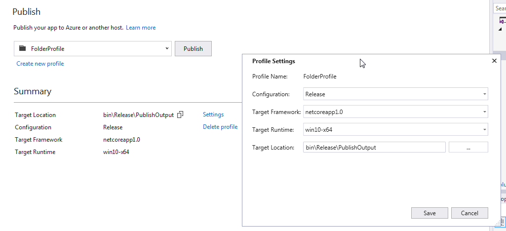
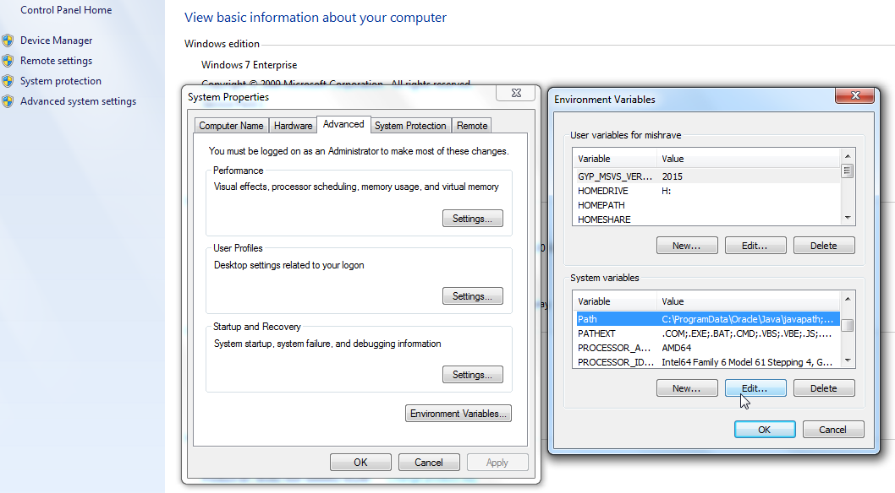
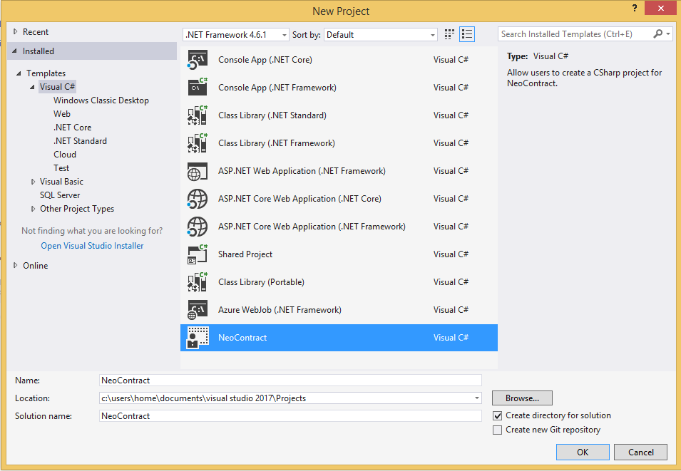
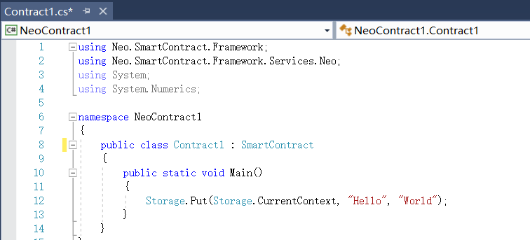
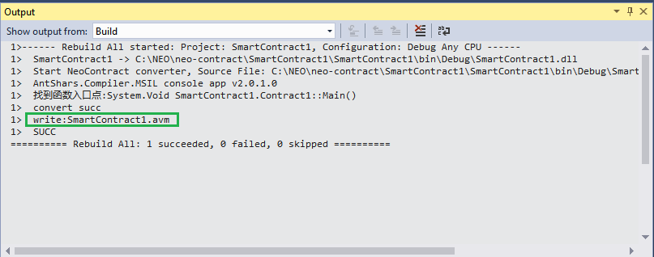

### How to use C# to write a NEO smart contract

We currently recommend C# for developing smart contracts (though we support or plan to support Java, Kotlin, Go, C/C++, Python, JavaScript and other programming languages).

This section contains a short tutorial that guides you in configuring the C# development environment for NEO smart contracts. It also gives you an idea of ​​how to create a smart contract project and how to compile it.

   > [!Note]
   >
   >    > At present, all the projects have been upgraded to the Visual Studio 2017 version. If you want to use Visual Studio 2015 to create intelligent contracts, refer to [how to use C # to write NEOs intelligent contract for VS2015](getting-started-2015.md).

## Development Tools

### 1. Visual Studio 2017

If you have already installed Visual Studio 2017 on your computer and checked for .NET Cross-Platform Development at the time of installation, you can skip this section.

Download and install:

[Visual Studio download address](https://www.visualstudio.com/products/visual-studio-community-vs)

The installation process is very simple, just follow the operation prompts step-by-step. It should be noted that you need to check the installation of `.NET Core cross-platform development`, otherwise you will not be able to open neo-vm project in step #3. The installation takes about ten minutes or up to an hour.



### 2. NeoContractPlugin

Installation method:

Open Visual Studio 2017, open Tools, click on Extensions and Updates, click on the Online tab on the left side of the window, search NEO in the search box on the top right corner of the window, download the NeoContractPlugin (this step requires internet access).



### 3. neo-compiler

Installation and configuration steps:

Download the [neo-compiler](https://github.com/neo-project/neo-compiler) project on Github, open the solution with Visual Studio 2017, and publish the neon project





> [!Note]
>
> During the process of publishing neon, if you are prompted neon.dll cannot be copied, you can manually copy the file with the same name from the upper-layer folder. 

After the release is successful, the neon.exe file is generated in `bin\Release\PublishOutput`.

We now need to add this directory to our execution path. The PATH is the system variable that your operating system uses to locate needed executables from the command line or Terminal window.

**Windows 10 and Windows 8:**

  In Search, search for and then select: System (Control Panel)
  Click the Advanced system settings link.
  Click Environment Variables. In the section System Variables, find the PATH environment variable and select it. Click Edit. If the PATH environment variable does not exist, click New.
  In the Edit System Variable (or New System Variable) window, specify the value of the PATH environment variable. Click OK. Close all remaining windows by clicking OK.

**Windows 7:**

  From the desktop, right click the Computer icon.
  Choose Properties from the context menu.
  Click the Advanced system settings link.
  Click Environment Variables. In the section System Variables, find the PATH environment variable and select it. Click Edit. If the PATH environment variable does not exist, click New.
  In the Edit System Variable (or New System Variable) window, specify the value of the PATH environment variable. Click OK. Close all remaining windows by clicking OK.



Now run Command or PowerShell, and enter neon.exe. If there is no error and the output shows the version number (as shown), then the environment variable configuration is successful.


NOTE. Windows 7 SP1 users might encounter an error "Unhandled Exception: System.DllNotFoundException: Unable to load DLL 'api-ms-win-core-console-l2-1-0.dll': The specified module could not be found". The required 'api-ms-win-core-console-l2-1-0.dll' file is only found in Windows 8 or later versions. This error can be resolved by obtaining a copy of 'api-ms-win-core-console-l2-1-0.dll' and putting it in the directory C:\Windows\System32. This dll can be found in other folders on your computer(search it, then copy it to \System32), or alternatively found online.

## Create project

After the above installation configuration is successful, you can create a NeoContract project in Visual Studio 2017.



Once you create a project, it will automatically generate a C# file. The default class which inherits the SmartContract is shown in the following:




## Compile the Project

Everything is now ready to add the entry method that defines the smart contract:

```c#
public class Contract1 : SmartContract
{
    public static void Main() // Note that the main method is capitalized
    {
        
    }
}
```

After you compile it successfully you will see `SmartContract1.avm` in the `bin/Debug` directory, which is the file that is generated as the NEO smart contract.



> [!Note]
>
> - Given that neon compiles .dll with nep-8 by default, which conflicts with nep-5, thus we need to execute .avm using neon compatible mode; otherwise the contract cannot be invoked properly.
>
>   Open Power Shell or command prompt (CMD), enter bin/Debug directory and input the following command (replace nep5.dll with your own project file):
>
>   `neon yourcontractname.dll --compatible`
>
> - For other issues you encounter during the process of  setting up the smart contract development environment, refer to [FAQ](../../faq.md).

Now that you have completed the configuration of the NEO smart contract development environment.