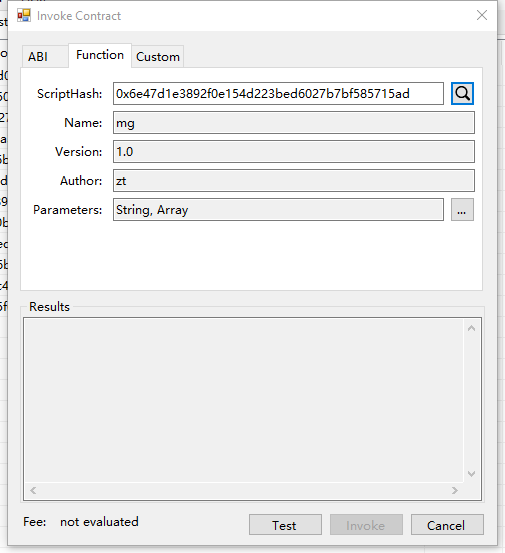
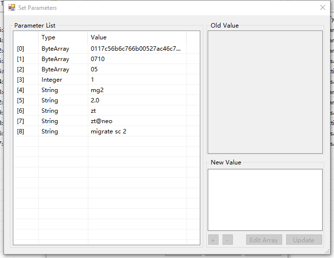
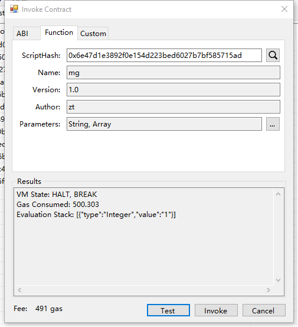
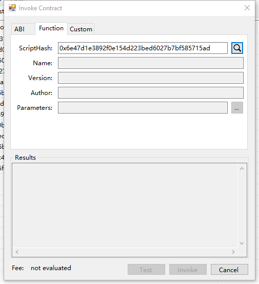

# Migrating Smart Contracts

In some cases you want to upgrade the smart contracts deployed on the blockchain or migrate the storage of a contract into another new contract, you need to migrate smart contracts.

This tutorial is based on:

- The example created in Visual Studio 2017
- NeoSmartContractPlugin v2.9.3
- The latest [Neo-GUI](https://github.com/neo-project/neo-gui/releases)

## Implementing the migrate interface
To enable migration function, you need to implement the migrate interface in the contract, as shown below:
```c#
       	...
	public static object Main(string method, params object[] args)
        {

            ...
            if (method == "migrate")
            {
                if (args.Length < 9) return false;
                byte[] script = (byte[])args[0];
                byte[] plist = (byte[])args[1];
                byte rtype = (byte)args[2];
                ContractPropertyState cps = (ContractPropertyState)args[3];
                string name = (string)args[4];
                string version = (string)args[5];
                string author = (string)args[6];
                string email = (string)args[7];
                string description = (string)args[8];
                return Migrate(script, 
                               plist, 
                               rtype, 
                               cps, 
                               name, 
                               version, 
                               author, 
                               email, 
                               description);
            }
            ...
        }
	private static Boolean Migrate(byte[] script, 
            byte[] plist, 
            byte rtype, 
            ContractPropertyState cps, 
            string name, 
            string version, 
            string author, 
            string email, 
            string description)
        {
            var contract = Contract.Migrate(script, 
                plist,
                rtype, 
                cps, 
                name, 
                version,
                author, 
                email, 
                description);
            return true;
        }
       	... // Some code segments are omitted
```

If you want to migrate the contract later, you must implement the migrate interface in the contract prior to deployment. For more information, refer to [Deploying and Invoking Smart Contracts](../quickstart/deploy-invoke.md).

## Migrating the contract
With your old and new contracts script hash in hand, let's invoke the migrate interface in your old contract using NEO-GUI.

> [!Note]
>
> To obtain the contract ScriptHash, you can go to NEO-GUI, click `Advanced` > `Deploy Contract`，and then `Load` the contract.

1. In NEO-GUI, click `Advanced` > `Deploy Contract`，and enter the old contract ScriptHash. The deployed contract information is displayed.

   

2. Click `Invoke` and then enter necessary parameters required for invoking the migrate interface.

   

3. Once completed, click `Test` to view the result.

   You will find the value 1-True is returned and the invoking fee is 491 GAS.

   

4. Click `Invoke` and wait for block's verification.
5. Once the transaction confirmed, enter the new contract ScriptHash in the Invoke Contract window. The new contract information is displayed. 

   

6. Enter the old contract ScriptHash again，you will no longer find the information displayed. 

   

That indicates the storage has been migrated from the old contract into the new contract, and meanwhile the old contract has been destroyed.
