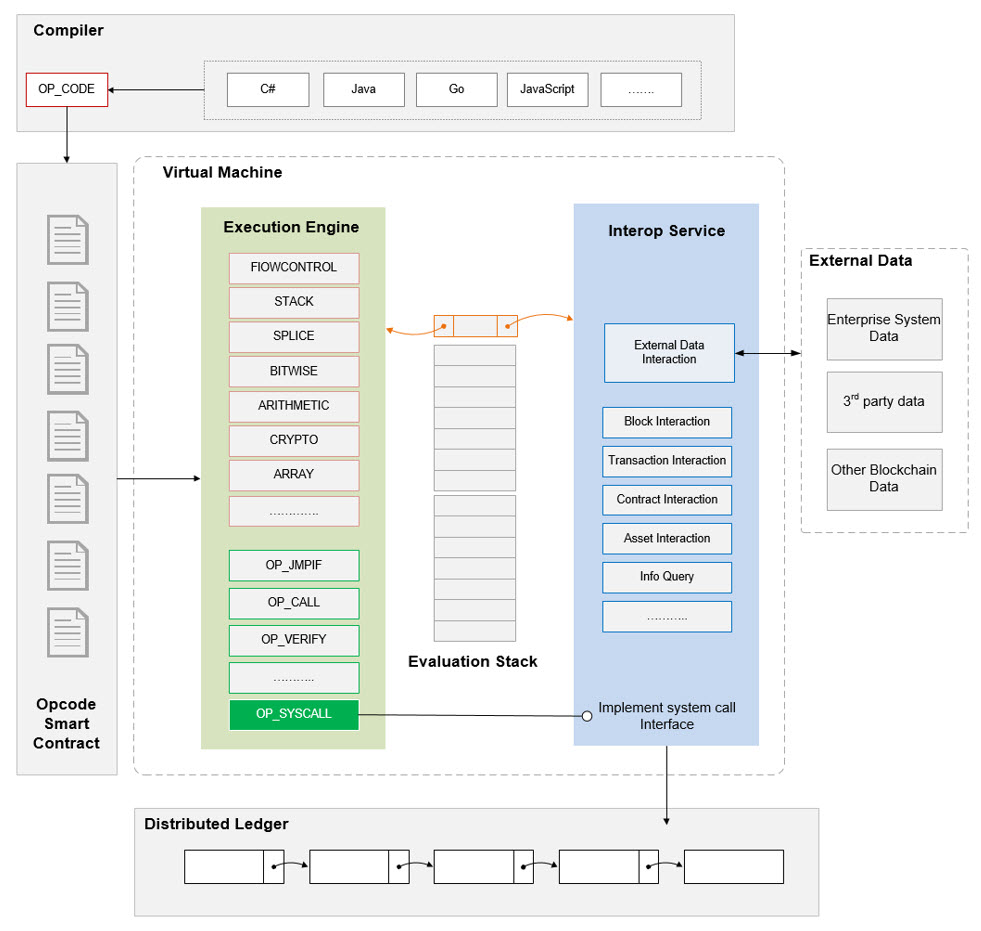

# Tutorial NEO Smart Contract

Dopo aver letto i precedenti tutorials, dovresti essere capace di usare C# in Visual Studio 2015 o 2017 per creare progetti smart contract. Qui discuteremo come gli smart contract vengono eseguiti su NeoVM (Neo Virtual Machine).

## Attivazione degli smart contract

Ci sono due modi per innescare gli smart contacts:

1. Contract User Authentication: Qui lo Smart Contract é un Account Contract. Quando l'utente richiede di utilizzare il contract account in un asset, attiverá lo smart contract. 

2. Chiamata manuale allo smart contract: Qui l'utente invia una transazione (Invocation transaction) per avviare l'implementazione di uno smart contract.

## NeoVM

NeoVM é la macchina virtuale che esegue il codice smart contract NEO. Ci riferiamo al concetto di macchina virtuale in senso stretto, non con riferimento a sistemi operativi i programmi che possono simulare gli stessi come VMware o Hyper-V.

Per esempio, nel Jva JVM o .NET CLR, il codice sorgente verrá compilato nel codice byte pertinente e poi eseguito sulla macchina virtuale corrispondente. Il JVM o CLR eseguiranno il codice byte, il quale é simile alle istruzioni eseguibili su una vera macchina fisica. In particolare, le istruzioni binarie corrispondenti vengono ancora eseguite si una macchina fisica. La macchina fisica prende le istruzioni dalla memoria, li trasferisce alla CPU tramite il bus, poi decodifica, esegue, e memorizza il risultato.

### Architettura della macchina virtuale

   

Il diagramma precedente é il diagramma dell'architettura del sistema della macchina virtuale di Neo (NeoVM), dove l'implementazione nella casella tratteggiata é la parte principale della macchina virtuale.

#### Motore di esecuzione

The green on the left is the Virtual Machine execution engine (the equivalent of the CPU). It can execute common instructions such as flow control, stack operations, bit operations, arithmetic operations, logical operations, cryptographic methods, and so on. It can interact with the Interoperable service layer (described below) through system calls.

#### Evaluation stack

The middle gray part of the the virtual machine is the Evaluation Stack (it is equivalent to memory). These days there are two ways to achieve a virtual machine 1) stack based and 2) register based. Both ways have their own advantages and disadvantages, and both have their own great implementation examples. There are stack-based virtual machines like JVM, CPython, and the .NET CLR. On the other side there are register-based VMs, such as Dalvik and Lua5.0. Stack-based virtual machines have a computing stack concept that allows virtual machines to interact directly with the stack (Evaluation Stack) when performing real operations.

Since the default behavior of a stack based VM is to fetch data from the operand stack, there is no need to specify an operand. Contrast this to for example the following x86 assembly `"ADD EAX, EBX"`. This operation requires you to specify the source operands and destination of the result. Stack-based virtual machine instructions do not need to specify these parameters. For example, the addition of a simple "ADD" operation will operate directly on the operand stack. The data can be popped of directly and the result is stored at the stop of the stack.

#### Interoperable service layer

The blue part on the right side is the interoperable service layer of the virtual machine (equivalent to the peripherals). At present, the interoperable service layer provides some APIs for accessing the chain-chain data of the smart contract. It can access block information, transaction information, contract information, asset information, and so on.

In addition, the interoperable service layer also provides a persistent storage area for each contract. Each of the smart contracts is optionally created with private storage, which is in the form of a key-value object determined by the callee of the contract rather than the context of the persistent store. The caller needs to pass their own storage context to the callee (to complete the authorization) before the caller can perform read and write operations.

### Charge mode

A smart contract can programmed to charge a certain fee, divided into deployment costs and execution costs.

Deployment costs refers to the need for a developer to pay a fee to deploy a smart contract on the block chain (currently 500 GAS). Execution costs refers to the fee the user pays for execution of the smart contract. All operations have a costs, with most operations defaulting to 0.001 GAS. The first 10 GAS is free. Priority processing can be achieved by manually increasing the execution fee. Read more about smart contract fees [here](systemfees.md#smart-contract-fees).

## A simple smart contract

Here are some simple smart contracts:

```c#
public static bool Main ()
{
    return true;
}
```

Here the return value of the contract is always true, indicating that anyone can spend the contract address of the assets (can be understood as money).

The NEO wallet client has a function for deleting an asset. When you delete an asset, the asset is sent to a specified address being the contract address generated by the above smart contract. Anyone can spend the assets in the address. The assets in the address are assets that others do not want.

```c#
public static bool Main ()
{
    return false
}
```

The return value of the contract is always `false`, indicating that the assets of this contract can not be used (this can be interpreted as burning or destroying an asset). Such a contract can for example be applied for shares of a company that have  been written off/canceled.

For more examples please see:

[Hello World](tutorial/HelloWorld.md)

[Lock (lock)](tutorial/lock.md)

[Domain (Domain Name System)](tutorial/Domain.md)
