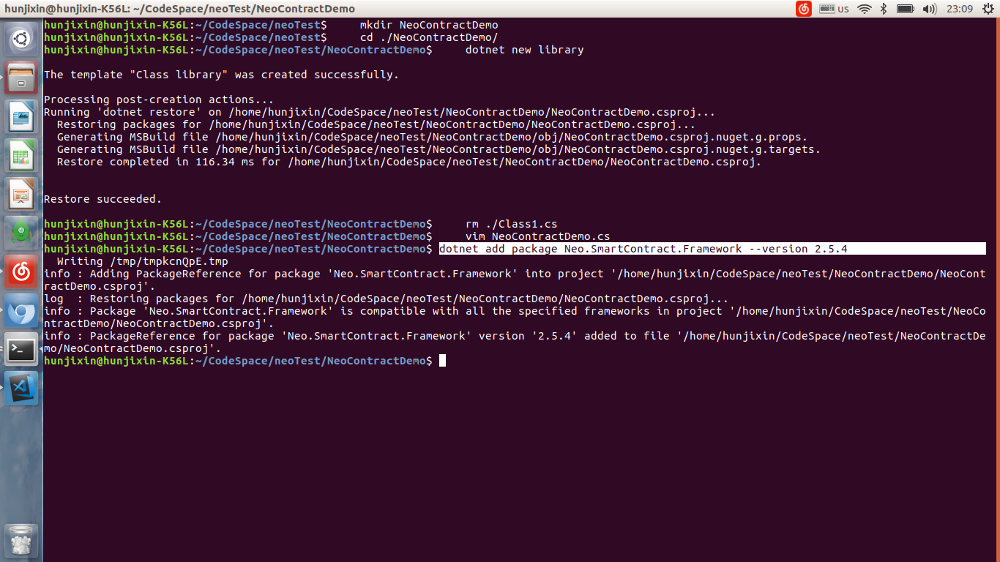
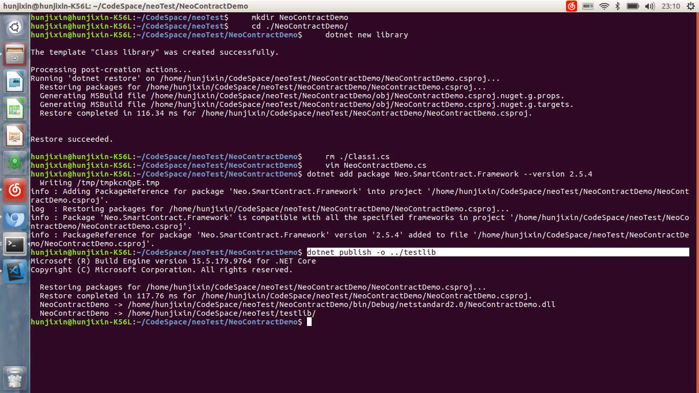

# 在 ubuntu 上如何用 C# 编写智能合约

   1. 创建library项目，引入智能合约库,添加自己的代码。
   2. 编译neo-compiler/neoa编译生成编译器。
   3. 执行命令运行neoa转换获得avm文件。

## 2. 新建合约项目

### dotnet命令行创建libaray项目

    mkdir NeoContractDemo
    cd ./NeoContractDemo/
    dotnet new library
    rm ./Class1.cs
    vim NeoContractDemo.cs

    键入下面代码后ESC+wq!保存退出

```c#
using Neo.SmartContract.Framework;
using Neo.SmartContract.Framework.Services.Neo;

public class NeoContractDemo: SmartContract
{
    public static bool Main()
    {
        return true;
    }
}
```


### 添加智能合约引用

    dotnet add package Neo.SmartContract.Framework --version 2.5.4



### 编译智能合约项目

    dotnet publish -o ../testlib



## 2. neo-compiler

    cd ..
    git clone https://github.com/neo-project/neo-compiler.git
    cd  ./neo-compiler/neon
    dotnet publish -o ../../testlib


## 3. 生成avm文件

    cd ../../testlib
    dotnet neon.dll NeoContractDemo.dll
    mkdir ../output
    cp NeoContractDemo.avm ../output/NeoContractDemo.avm


完整脚本参考：
[https://raw.githubusercontent.com/hunjixin/NeoContractBuildScriptOnUbuntu/master/SmartContract.sh]
