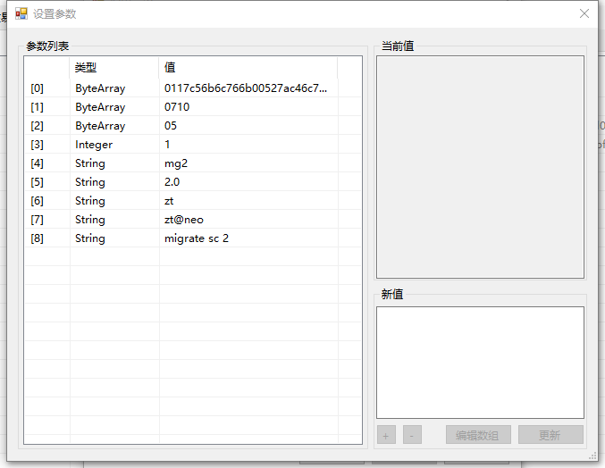
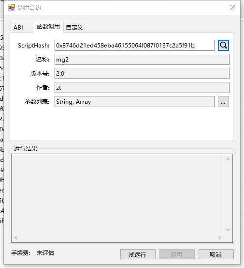
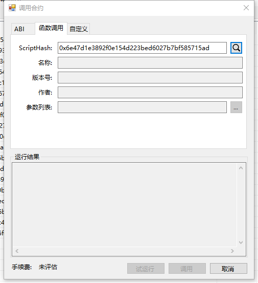

# 合约迁移

当需要将原来已经部署使用的合约进行升级或者想将旧合约的存储区迁移到新合约的时候，需要用到合约迁移的功能。

本教程是基于 Visual Studio 2017 中创建的示例，演示如何进行合约的迁移，请确保 Visual Studio 升级到了 2017 版本。另外本教程是基于智能合约 框架NeoSmartContractPlugin v2.9.3 的演示，请从 GitHub 中下载最新的客户端运行（[Neo GUI](https://github.com/neo-project/neo-gui/releases)）。

## 实现Migrate接口
如果要使用合约迁移的功能需要在原有合约中实现迁移接口，如下：
```c#
       	...
	public static object Main(string method, params object[] args)
        {

            ...
            if (method == "migrate")
            {
                if (args.Length < 9) return false;
                byte[] script = (byte[])args[0];
                byte[] plist = (byte[])args[1];
                byte rtype = (byte)args[2];
                ContractPropertyState cps = (ContractPropertyState)args[3];
                string name = (string)args[4];
                string version = (string)args[5];
                string author = (string)args[6];
                string email = (string)args[7];
                string description = (string)args[8];
                return Migrate(script, 
                               plist, 
                               rtype, 
                               cps, 
                               name, 
                               version, 
                               author, 
                               email, 
                               description);
            }
            ...
        }
	private static Boolean Migrate(byte[] script, 
            byte[] plist, 
            byte rtype, 
            ContractPropertyState cps, 
            string name, 
            string version, 
            string author, 
            string email, 
            string description)
        {
            var contract = Contract.Migrate(script, 
                plist,
                rtype, 
                cps, 
                name, 
                version,
                author, 
                email, 
                description);
            return true;
        }
```

> ... 省略了部分代码

只有在合约中有调用Migrate方法的接口才支持迁移，所以如果在部署合约之前，希望以后对此合约进行迁移的话，必须实现Migrate接口。

然后部署你的合约，请参考[部署和调用合约](../quickstart/deploy-invoke.md)

## 进行合约迁移
首先准备好新合约的avm文件，获取内容。可以通过NEO GUI>`高级`>`部署合约`中`加载`复制内容作为script参数。然后通过NEO GUI调用旧合约的Migrate的接口.

* 打开NEO GUI >`高级`>`调用合约`，输入旧合约的ScriptHash, 此时可以找到部署过的旧合约。


* 输入调用Migrate接口所需要的参数。



* 输入完成后试运行查看结果。


> 可以看到返回1-True,手续费为491gas。

* 然后点击调用，等待区块确认交易。
* 确认后，在调用合约界面输入新的合约ScriptHash，可以查看到新的合约内容。



* 输入旧合约ScriptHash, 发现已经查询不到了。



这时候旧合约的存储区迁移到新的合约上，旧合约被销毁。
