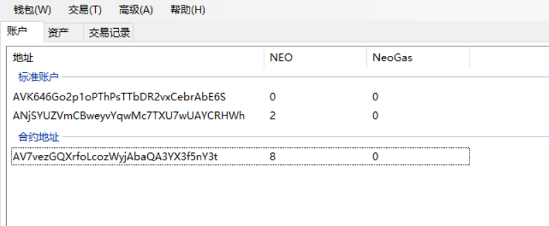
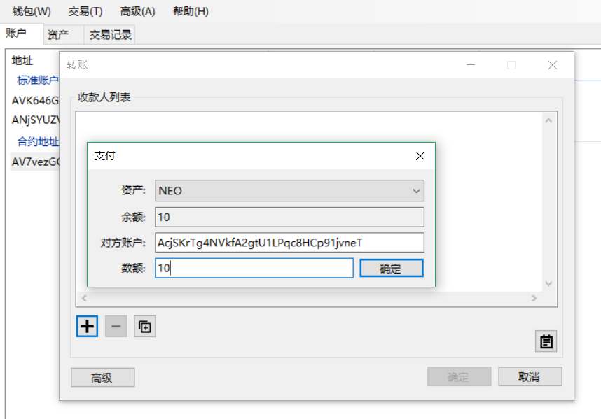

# 鉴权合约示例

当从一个智能合约鉴权账户转出资产时，共识节点在验证交易时会执行该智能合约。如果合约验证成功（返回结果为 true），则交易确定。否则这笔交易无法完成，一直处于 “未确认”状态。

本教程是基于 Visual Studio 2017 中创建的示例，请确保 Visual Studio 升级到了 2017 版本。另外本教程是基于智能合约 2.7.4 的演示，请从 GitHub 中下载最新的客户端运行（[Neo GUI](https://github.com/neo-project/neo-gui/releases)）。

## 编译合约文件

首先，参考 [如何用 c# 编写智能合约](../getting-started-csharp.md)，使用如下示例内容编译生成一个智能合约文件，Test.avm。

```c#
using Neo.SmartContract.Framework;
using Neo.SmartContract.Framework.Services.Neo;
using Neo.SmartContract.Framework.Services.System;
namespace Neo.SmartContract
{
    public class Test : SmartContract
    {
        public static bool Main(byte[] signature)
        {
            return true;
        }
    }
}
```

## 创建钱包

在 NEO-GUI 客户端中，点击 `钱包` -> `创建钱包数据库` 创建一个钱包。

## 获取合约脚本

可以选择以下一种方法获取合约脚本：

- 使用如下的 C# 代码读取 .avm 文件：

  ```c#
  byte[] bytes = System.IO.File.ReadAllBytes("Test.avm");
  for (int i = 0; i < bytes.Length; i++)
      Console.Write(bytes[i].ToString("x2"));
  ```

  获取到 Test.avm 的合约脚本（二进制数据）为：    
  52c56b6c766b00527ac461516c766b51527ac46203006c766b51c3616c7566


- 使用 NEO-GUI 客户端获取：
  1. 在客户端中点击 ` 高级 ` -> ` 部署合约 `
  2. 在右下角点击 ` 加载 `，选择编译后的 Test.avm 文件
  3. 在 ` 代码 ` 框显示出合约脚本，将其复制备用。


## 创建合约地址

1. 创建完钱包后，在客户端中点击鼠标右键 -> `创建合约地址` -> `自定义`，使用上一步生成的合约脚本创建合约地址。


2. 在 `导入自定义合约` 对话框中设置以下选项：
   a. 形参列表：参考 [智能合约参数和返回值](Parameter.md)，由于我们的合约中有一个 signature 参数，所以此处要填写 00 。
   b. 脚本代码：填写上一步复制的合约脚本代码。
   c. 私钥：可选参数，当合约执行过程中需要签名时，设置用于签名的私钥。

   

3. 点击 ` 确定 ` 后，智能合约鉴权账户创建成功。


## 测试

下面就可以对刚创建的智能合约鉴权账户进行测试，测试方法是先向合约地址转入一笔资产，再将其转出，验证合约是否执行成功。

> [!Note]
> 为了更简单验证测试结果，钱包中的标准账户里最好不要有资产，或者转账金额要大于标准账户资产，以确定资产是从合约账户转出。

### 转入资产到合约地址

转一定数量的资产到你的合约账户：



### 转出合约资产

从你的智能合约账户中转出资产：




### 结论

如上图所示，客户端中资产的余额是标准账户和合约地址中资产的加和，所以这里显示的是所有地址的资产。但你是否能使用合约地址中的资产是依据智能合约的运行结果，如果合约执行成功（返回结果为 true），则这笔资产可以转出，否则将无法转出。